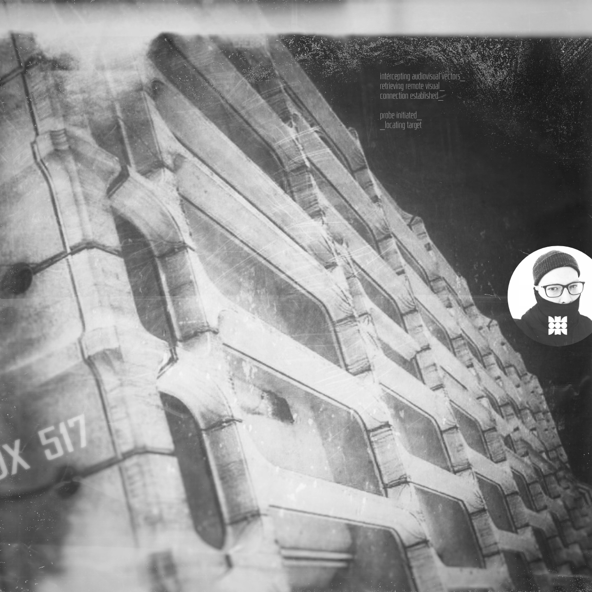

# HITECH CRIME / CINEMATIC NARRATIVE UNIVERSE TRANSMEDIA MUSIC MICROLABEL
```
THE WEYLAND-YUTANI OF TRAP MUSIC / CYBERPUNK 2077 FOR MUSIC / DARKWAVE TRAP
```
```
MINIMAL FUTURA AGGRO TRAP 
CHANTRAP 
FUTURAP 
HITECH CRIME MYTHOS
DARKWAVE TRAP
DARK CYBERPUNK
ALT-FUTURA CINEMATIC UNIVERSE
AUDIO FUTURA
MANTRA-P
```
## /// Introduction_
**Hitech Crime** is a **cinematic narrative universe transmedia music microlabel** being set in [Helve AVR](https://github.com/HELVE/H_OVERVIEW)'s **dark moon metabrand system**. It acts as a unified identity hub for creative and experimental audio projects. It exists both in the fictional universe as well as in reality.

### Creative Aim_

Its *creative aim* is to build an audiovisual narrative universe with unique lore and narratives. In its purest initial form it was intended as a creative prison for my negative emotions and thoughts. 

It presents a path of progress and understanding through narrative story arcs to draw in the audience and teach them important elements of life while simulatenously entertaining.

I used it as a tool to understand and express past and present suffering and discover the sense of self through various endeavours. 

### Technical Aim_

Its *technical aim* is to research, develop and execute ideas in form of new wave interactive performances/experiences and create futuristic audio and related visual communication using creative technology.

### Metaphysical Aim_

Be a helping hand for people to reach their own fulfillment by discovering their core self and core drives, to help them become a better version of themselves. Later described in The Storyworld section of the repository.

### Themes_

Agents and Operatives of Hitech Crime are a semi-fictional organization with subversive intentions (think SCP Foundation of Cyberpunk/dark dystopia).

As an always evolving expressive entity it hybridizes, explores and dives into topics of:
- psychology / human psyche
- belonging / group identity
- self / personal identity
- duality / multiplicity 
- path of self-anarchistic creativity / life progress
- negative emotions
- depression / coping
- addiction / cravings
- spiritualism / shamanism / synthetic nature
- occult / mysticism
- religion as a tool
- consciousness / belief
- human relationships
- freedom of the mind
- x-patic behaviours
- near future cyberpunk
- advancement of technology
- predictive societal changes
- transhumanism / human edge
- creative operations
- rogue squads and operations
- subversive methodologies
- dark web society

## /// STORYWORLD [THE UNIVERSE]


### The Meaning_
I had the most profound realization last night. Perhaps the base foundation for Hitech Crime lore/universe/meaning of it all.

The self-development system I created to get myself out of a severly bad mental situation in life called Dopamine Trails talks about reaching your "core self", about getting rid of negative dopamine triggers to reach it. It is the origin of all the metabrands/manifestations of different parts of my character (Helve AVR, Hitech Crime and Kannibal). They wouldn't be here if I wouldn't self-analyze myself to such extent.

Hitech Crime and my core self has always been going into the symbolism of triangles in a conceptual sense. In esoteric sense it symbolises fire within fire, endless creation, endless sustenance, self-sustaining order within total chaos of life. This can get as esoteric and occult as we want but it seems to make sense in its basic symbolism as well. Power of shapes always plays a role in our subconscious.

Here is a way the triangles tie into the universe of Hitech Crime with its main purpose as a metabrand to make people realize the existence of their own core self through transformation of negative aspects into something productive.

### Upward Triangle_ [🔺]
Imagine an Upward Triangle. (Future/Spirit) as the priority at the top, (Past/Mind) and (Present/Body) at the bottom corners - that symbol as a whole signifies the ascent into divine realm of rational (getting rid of unnecessary dopamine triggers in life). 

This attaches easily to the concept of Upright Hierophant from Tarot: he's a translator between higher consciousness and mankind, spiritual guidance, knowledge-giver. This is what we are striving for in a way - to reach the Upright Hierophant in a more or less metaphysical way or unlock him within us by self-realizing our own needs and goals in life. In the old order Upward Triangle is described as masculine.

Upright Hierophants are our self-analyzed core drives guiding us to where we truly want to be - hardly influenced, promoting positive reinforcement of the main goals.

### Downward Triangle_ [🔻]
Now imagine a Downward Triangle - (Past/Mind) and (Present/Body) being the top two points of priorities for a person. (Future/Spirit) at the bottom. The descent into corporeal, degrading and torn human. 

This one signifies the Inverted Hierophant in Tarot: corrupted by negative dopamine, spreading dogmatic teachings, indoctrinating, promoting inflexible thinking (being drawn to the same things over and over - addiction). In the old order Downward Triangle is described as feminine. 

Invereted Hierophants are our thoughts and emotions - easily influenced and solidified into bad patterns.

### Core Self guided with the Upward Triangle_
The way I see it - dopamine in Dopamine Trails can be either Upright Hierophant (guidance) or Inverted Hierophant (corruptor). An upward triangle or a downward triangle. Establishing the core self of our person existing within the Upright Triangle to act as a self-guiding force - that is the goal of life as well as the main core drive for Hitech Crime, which is establishing a world for transformation of self, transformation of negative thinking and emotions into productive patterns. 

Think of Core Self as an Upward Triangle with a dot in it as the symbol. 

### Hitech Crime Being The Link Between Two States_
Now how this ties into the Hitech Crime in terms of the universe we are creating as a microlabel. Remember that Hitech Crime is a semi-fictional organization/agency within that universe. It acts as a link/helping hand towards reaching the core self for others. It has a goal of guiding people from Downward Triangle to the Upward Triangle by traditional and subversive means. It aims at least to balance the triangles for people.

Since we are going with the delicate sci-fi cyberpunk theme - the core self could be made to mean the unifying metaphysical space that we can all tap into. Inner consciousness in a bigger collective consciousness of the virtualized world.

### The Path To The Top_
Path goes from bottom to top:
🔺 
]|[
🔻

/// DIRECTOR OPERATIVE MOTHNODE / 30052020

> The point with Hitech Crime is to see the corruption of the perceived oneness, call it out and purge in order to reunite with self. In a more of a tarot vibe - HC is the upright hierophant in its intent and the aim is to draw light to the inverted hierophant, the corruptor so it gets recognized. This way HC connects with Dopamine Trails system which lies at the core of all I’m doing.

## /// TIMELINES

### NEARSIGHT Timeline
Alt futura, near future society in the process of changing due to technological advancement. Minimal tech present, gentle hitech themes, similar to present society but a tiny bit more advanced.

### DISTANT Timeline
Proper Cyberpunk 2077 vibes. Distant future dystopia.

### HYBRID Timeline
Timeline which is semi-fictional. Focuses on the endless collaborative album (collabs, Hitech Crime hybrids). Might be a lot less fictionalized for the purposes of following a narrative. Might be entirely based in reality as a "side content".

## /// VISUAL COMMUNICATION OF THE BRAND NOTES_

Album/song releases are like plot points in a bigger narrative (overarching themes) accompanied by rich media content. Various timelines are different subthemes: cyberpunk, dark trap, scifi, tribalism, control your future, human enhancement/transhumanism etc.

Seasons are overarching themes. A "whole set" would be all elements of content that belong to the a particular season (story arcs, microthemes, album narrative music videos etc).

What we're creating here is a "storyworld". We are basing it on trap music and culture but want to completely change the approach to this and any type of music/genre as a not only solely audio experience. 

---

Think of Hitech Crime metabrand dark trap microlabel as a virtual city or a digital experience where you join your friends and new acquaintances in experiencing and actively interacting with an entire semi-fictional cinematic and gamified universe. It has its own characters, places, events, puzzles, its own lore and can almost feel like a live realtime game taking place both online and in real life as new chapters, timelines, themes are released to consume. You are invited to collaborate with the creators (operatives) themselves and be part of an endless fictional story filled with mysteries.

---

RED band as the late-realized inspiration for narrative Hitech Crime stories

---

Creating engaging content (in my case semi-fictional universes with story arcs and narratives for each of the 3 brands) that pulls in the audience seemingly to give them entertainment but throughout the process it starts to deliver important and thought-provoking concepts. Transmedia storytelling and gamification of the story depending on the brand. Microlabel is more of a cinematic storytelling (music albums hybridized with interactive installations and short films) while techwear clothing brand Kannibal has a cinematic narrative universe that is constructed and is an excuse to showcase future potential of technology to badly influence societies. It is like reverse engineering escapism and making people self-aware and fully conscious of their choices.

Gather user content: „respond with a photo or video of yourself doing the Hitech Crime sign and I’ll repost you” ]|[


---

## Website Lore Tie-ins

MUSIC VIDEOS AND FILM CONTENT HAVE HIDDEN PINGS THAT ALERT VIEWERS TO INTERACTABLE CONTENT THEY CAN DISCOVER (QR CODES TO SCAN BEING PINGED DIMLY IN THE BACKGROUND). ONCE THEY ACTIVATE THE CODE THEY ARE LEAD TO HITECHCRI.ME WEBSITE WHERE ASSOCIATED ELEMENT OF LORE IS BEING DESCRIBED TO A LARGER EXTENT.

---

## Current Drawbacks and Feedback

> I find that I’m a high level reader but when I see your stuff, my first thoughts are damn this is a lot of words. And it’s high level complexity too. You’re on a wave big time, your people seem to be on the tempo with it though. I’m always looking to simplify the knowledge for those who don’t know. If you make it so simple and clear with layman’s English and lead up to the overall constructs, this shit would go hard. People don’t like reading for the most part. This is what I’ve learned from my work. The Less words needed to communicate the better.

True, I’ve been told I need to narrow the level of complexity at least at the entrance.

> You’re on a wave big time, your people seem to be on the tempo with it though. You’re an intellect for sure. Most people can’t keep up. I’m always looking to simplify the knowledge for those who don’t know

Yeah, my aim now is to design a website (in progress) that is kind of like a hub, slowly introducing the audience to elements of it all. Which will also be the main audiovisual content hub. That is what I want as well - I’m kind of working inwards - like made the massive strokes of the brush, now on the details and then gonna work on giving the whole clear picture to the viewer if that makes sense - to make it approachable. I want to use more visuals and audio / written text will be just a bonus in terms of lore. A percentage of the whole communication, for those who want to go even deeper. The golden users, the cult. Like with ARGs really. The juicy stuff is “at the end of the labyrinth”.

> Are you looking at this as a business model?

Yes, from the very beginning. Helve at its core will be a creative agency providing services for branding and communication of this kind of breed of projects. HC is like a proof of concept. HC and Kannibal are the test field.

> You might benefit from the idea of the 4 product empire: Free offer, Core offer, Up sell, Subscription.

Ah yes, I am familiar. All HC base content will be free. Free stuff “sells” the most. It establishes the connection.

> You are versed in the marketing world then. It’s rapport building.

Hehe I do community management and marketing for a living. Used to do it mostly for game development companies but switched my field and learned a hell lot more by expanding the horizon. I even have already the structure of the 4 product empire in terms of naming - just realized. Sort of tho. Need to think on this more as I did a split between Agents (audience/warm clientele) and Operatives (the creatives collaborating on the projects). But it would go something like this:

- agents - free offer
- agents - core offer
- operatives - upsell
- prime agents - subscription

Transitioning into Operative would possibly be taking creative part in making of the universe/project. Including people who are most passionate to become parts of the universe. Just spitballing here rn. The idea since the beginning was to include even the base users / Agents as being part of something larger - HC in its fictional sense is an agency as well. And of course a whole array of physical products for “the hot ones” - album releases, merch made by Kannibal brand, hidden bonus content (but don’t want to gate the content to anyone), even like 3D printed props from the universe’s narrative (got plenty of ideas for a variety of possible products, gonna be testing as I go along) (...) Oh yeah, back to the “array of products” obviously forgot to mention the main core content which are the cinematics/films/viewing content which could also be package as universe in a bundle sort of - but these are all obviously for people who are invested in this emotionally/hooked. Not for the base Agents who are just warm but usually not willing to spend a dime just yet. I mean let’s take a closer look at Disney, they live off of toys/merch. I mean heck, first elevator pitch for HC had a phrase “the marvel universe of trap music”. Just like Helve AVR was the “Agents of Shield of creative industry”. Now HC has shifted a bit into to “the Cyberpunk 2077 of darkwave trap” vibe as a lot of people seem to want this kind of vibe - and the fun part is that that exact vibe was built into the idea from the start too, just later down the timeline of the universe as it progresses through chapters and years. HC starts as a alternative near future world with minimal but more advanced tech and then it evolves further and further and grows into full-fledged cyberpunk. Initial feeling was it was gonna go into Alien vibe, like Weyland-Yutani corporation type of agency but it shifted too. Now we got Nearsight Timeline and Distant Timeline in terms of constructing the universe.

## LOGO LORE / MEANING

```
]|[
```
It was intended as a bold brutalist architecture symbol on its own, a timeless etching - it contains the initials letters of Hitech Crime. A symbol of stability and expansion, a "monument to the future", which is also the title of the first cinematic film set in the HC Universe.

Hitech Crime in its basic form was supposed to be a near future alternative reality setting but it expanded a lot since then into cyberpunk as well. Planning possible enhancement of it in the future.

## GENERAL

RED (EMOTION - NEGATIVE) + WHITE (BALANCE - POSITIVE)

- minimal
- intricate?
- cyberornate (both logo-wise and ux-wise)
- bold, brutalist
- lots of brutalist architecture in motion pictures
- as few lines and cutouts as possible (modularity?)
- easy to replicate visually
- stencil form / neon form / marker action form
- balanced
- timeless symbol
- better ratios
- symbol includes H C I T letters (subliminal)
- slimmer core to adjust to 16:9 content and widescreen
- hitech is hidden energetic, operational dashboard vibe
- final logo needs to have red bg or elements to correlate with the brand theme.
- futuristic elements but tones - practical.
- bigger visual style of the universe, semi-fictional Operatives of Hitech Crime are black ops of trap music, HC is the undercover "corporation" trying to hack the world for the better (positive anarchy)
- krotalox (shadowtech)
- aoku (techwear)

**LOGO NOTES**

- needs character/weight to it at some points
- needs to work aesthetically with UI/UX
- needs to have some sort of look to it as reference images
- easily replicable
- choose 3 MAIN BRAND FONTS

```
NOTES

Hitech Crime Content Framework Idea: Album 11 songs (web series), EP 3 songs (3 act film), Single 1 song (short film).

Alternate Reality YouTube VLOG/SERIES (Render weird things in the distance, colossus buildings, “disregard the goliath we are not here to visit it”) Alternate reality operative travel/mission logs

Spark AR Custom Instagram Filter for Hitech Crime.

Connecting 30+ bluetooth headphones to one source for quiet rogue concert in public

Agent Missions
Release:
each song 0/250 views timeline, with steps > unlock short film > unlock next chapter
General
0/50 subs

```

AUDIO AMBIENCE_ 2814 : Rain Temple https://www.youtube.com/watch?v=7eRf__n7VPg

２８１４ - 新しい日の誕生/Birth of a New Day (Full Album) [HD] https://www.youtube.com/watch?v=F9L4q-0Pi4E

To access the Core in the fictional universe one could have an implant at the back of their head with a symbol of Hitech Crime and when accessing it the left and right side of the logo would slide horizontally locking in the mode.

Animation spanning all albums - inverting of the triangle.

I'm testing a structure for a first "pilot episode" single release called "TRIBE": https://github.com/HITECHCRIME/HC_SG_R01_TRIBE

```
STORY > TECH > AUDIENCE
```
“Humans do not engage in activities that are meaningless. If you think you see people doing things you find meaningless, look again, and try to understand what the activities mean for them.”

– Henry Jenkins

It could be argued that every life, your very own is a transmedia narrative unique to you and the multitude of facetes your present your "self" to the world. 

Transmedia storytelling has no beginning, middle or end. Let the audience fill in the gaps with their engagement on various platforms of expression. This leads to potential monetization of engagement via "subscribing to a storyworld". Hitech Crime microlabel is a universe that the audience can explore and help it evolve. Think of Westworld business model - I know, ironic since it's ficticious and technology is not there yet. But the idea is similar.

Hitech Crime Universe. Depends on the timeline: dystopia, cyberpunk, near future, alternative real world timelines.

Hitech Crime Storyworld comes from a VOID [all possible futures/timelines], then it goes through ASCENSION [progress of all possible futures/timelines] into RELEASE [enlightenment and the making of choice].

Construct a dopamine loop (memetic dependence based on subconscious value of acknowledging the search for purpose in life, search of identity, search for self and core drives).

HITECH CRIME UNIVERSE < content content content > AUDIENCE (sustained feedback loop via audience interaction)

(both ways interaction, get personal, send things, choose at random, create engagement)

A little bit of David Lynch approach: 

- We live as characters in different Hitech Crime Universe timelines (within HCU, not overview branding-wise, not in terms of narrative brand entities). We can become selfaware. Cross the worlds between fiction and reality.

> Spirit of film (giant)
> Spirit of tv (midget)
> Spirit of internet (?) (the fire itself?) < --- time to face this demon

- commentary on consumable ficticious violence and the meaning of meaning

# Transmedia Storytelling Notes

> Dee Cook at Workbook Project even described the “transmedia” content at SXSW 2011 (where it was a boiling hot topic) in this way:

> …the most overused and under-understood [term] of the conference… Most of the “Transmedia” panels just didn’t seem to get it – there was no takeaway, there was a lot of gobbeldygook, and in one bizarre case, there was a futurist who seemed to be discussing how in 6-10 years we will all be watching programmed television.

> After SXSW, Steve went on in another series of ranting tweets (read the full exchange here):

> Telling ONE story on multiple platforms is NOT the same as telling many stories in the same universe on multiple platforms…  By that definition, the earliest example of Transmedia is the Bible: stories, live events, plays, meetups, music, swag….  and if that’s the case, Transmedia is NOT SOMETHING NEW at all!

> Transmedia SHOULD mean ONE SINGLE story on multiple platforms, not MANY stories in the same story world on many platforms

> Franchising is NOT Transmedia. It’s FRANCHISING

BENEFITS

- Transmedia encourages and supports consumer participation, from interactions across channels to the co-creation of products, stories, and messages.
- Transmedia allows the brand to go “surround sound.” This means, when a customer is looking for insights about your topic, your information is available on their channel of choice, from social media to podcasts to documents.
- Leverage multimedia content to create a richer brand experience across channels by experimenting with emerging channels such as podcasts, virtual reality, brand-run TV shows, and more.
- Amplify messages and explore the best format for telling them—by experimenting with a full range of different forms and media to flesh out a complete transmedia strategy.

LIMITATIONS

- Coordinating and collaborating with individual sectors of a media conglomerate can be a challenge.
- While entry points may entice a range of consumers, it may also provide many points to push consumers away.
- It could get hard to understand the entire dynamic of a franchise if you have several content creators.
- Balancing content between hardcore fans and casual fans is a daunting task.
- Not all stories are suitable for transmedia storytelling.

> A story that moves in an entirely unconventional direction is an essential component of transmedia storytelling. The three pillars namely, the core story, the worldview, and the main characters aim to establish multi-platforming. Which means, they are designed to be open stories that can be developed into different media. They do not own one another but serve as an entry point to the next installment of the franchise.

Independent Film Perspective

> With no multi-million dollar campaigns, the success of independent films is achieved through a strong word of mouth and good reviews from the press (also, a few awards at the most important festivals). Transmedia approach allows the producers and the film’s creative team to start establishing that word of mouth process early on so it can grow, like a snowball, during the entire production process, so when the movie is released it already has an audience. The success of films like Paranormal Activity, Blair Witch Project, and the more recent Kevin Smith’s Red State was the result of the buzz established by the production using social media and the internet. 

> The unique ability of transmedia storytelling to utilize various forms of media to widen consumer choice and to provide familiar yet new content gives it an outstanding potential as a marketing strategy. And for consumers to properly engage with the created narrative through this strategy, it is necessary to try out multiple media platforms and contribute to the available information and knowledge about the story.

> However, these qualities of transmedia storytelling also have the potential to create a negative effect on the marketability of a product, merely because not all consumers are willing to navigate through various platforms to fully understand the narrative world. As the story adds information and content, it has the risk of morphing into something that only appeals to a small group of cult fans rather than the mass audience. It is vital to offer a story that inspires consumers to actively participate in the larger network of content for you to reach the full market potential of transmedia storytelling.

1. Transmedia storytelling represents a process where integral elements of a fiction get dispersed systematically across multiple delivery channels for the purpose of creating a unified and coordinated entertainment experience. Ideally, each medium makes it own unique contribution to the unfolding of the story. So, for example, in The Matrix franchise, key bits of information are conveyed through three live action films, a series of animated shorts, two collections of comic book stories, and several video games. There is no one single source or ur-text where one can turn to gain all of the information needed to comprehend the Matrix universe.

2. Transmedia storytelling reflects the economics of media consolidation or what industry observers call "synergy." Modern media companies are horizontally integrated - that is, they hold interests across a range of what were once distinct media industries. A media conglomerate has an incentive to spread its brand or expand its franchises across as many different media platforms as possible. Consider, for example, the comic books published in advance of the release of such films as Batman Begins and Superman Returns by DC ( owned by Warner Brothers, the studio that released these films). These comics provided back-story which enhanced the viewer's experience of the film even as they also help to publicize the forthcoming release (thus blurring the line between marketing and entertainment). The current configuration of the entertainment industry makes transmedia expansion an economic imperative, yet the most gifted transmedia artists also surf these marketplace pressures to create a more expansive and immersive story than would have been possible otherwise.

3. Most often, transmedia stories are based not on individual characters or specific plots but rather complex fictional worlds which can sustain multiple interrelated characters and their stories. This process of world-building encourages an encyclopedic impulse in both readers and writers. We are drawn to master what can be known about a world which always expands beyond our grasp. This is a very different pleasure than we associate with the closure found in most classically constructed narratives, where we expect to leave the theatre knowing everything that is required to make sense of a particular story.

4. Extensions may serve a variety of different functions. For example, the BBC used radio dramas to maintain audience interest in Doctor Who during almost a decade during which no new television episodes were produced. The extension may provide insight into the characters and their motivations (as in the case of websites surrounding Dawson's Creek and Veronica Mars which reproduced the imaginary correspondence or journals of their feature characters), may flesh out aspects of the fictional world (as in the web version of the Daily Planet published each week by DC comics during the run of its 52 series to "report" on the events occurring across its superhero universe), or may bridge between events depicted in a series of sequels (as in the animated series - The Clone Wars - which was aired on the Cartoon Network to bridge over a lapse in time between Star Wars II and III). The extension may add a greater sense of realism to the fiction as a whole (as occurs when fake documents and time lines were produced for the website associated with The Blair Witch Project or in a different sense, the documentary films and cd-roms produced by James Cameron to provide historical context for Titanic).

5. Transmedia storytelling practices may expand the potential market for a property by creating different points of entry for different audience segments. So, for example, Marvel produces comic books which tell the Spider-man story in ways that they think will be particularly attractive to female (a romance comic, Mary Jane Loves Spiderman) or younger readers (coloring book or picture book versions of the classic comicbook stories ). Similarly, the strategy may work to draw viewers who are comfortable in a particular medium to experiment with alternative media platforms (as in the development of a Desperate Housewives game designed to attract older female consumers into gaming).

6. Ideally, each individual episode must be accessible on its own terms even as it makes a unique contribution to the narrative system as a whole. Game designer Neil Young coined the term, "additive comprehension," to refer to the ways that each new texts adds a new piece of information which forces us to revise our understanding of the fiction as a whole. His example was the addition of an image of an origami unicorn to the director's cut edition of Bladerunner, an element which raised questions about whether the protagonist might be a replicant. Transmedia producers have found it difficult to achieve the delicate balance between creating stories which make sense to first time viewers and building in elements which enhance the experience of people reading across multiple media.

7. Because transmedia storytelling requires a high degree of coordination across the different media sectors, it has so far worked best either in independent projects where the same artist shapes the story across all of the media involved or in projects where strong collaboration (or co-creation) is encouraged across the different divisions of the same company. Most media franchises, however, are governed not by co-creation (which involves conceiving the property in transmedia terms from the outset) but rather licensing (where the story originates in one media and subsequent media remain subordinate to the original master text.)

8. Transmedia storytelling is the ideal aesthetic form for an era of collective intelligence. Pierre Levy coined the term, collective intelligence, to refer to new social structures that enable the production and circulation of knowledge within a networked society. Participants pool information and tap each others expertise as they work together to solve problems. Levy argues that art in an age of collective intelligence functions as a cultural attractor, drawing together like-minded individuals to form new knowledge communities. Transmedia narratives also function as textual activators - setting into motion the production, assessment, and archiving information. The ABC television drama, Lost, for example, flashed a dense map in the midst of one second season episode: fans digitized a freeze-frame of the image and put it on the web where together they extrapolated about what it might reveal regarding the Hanso Corporation and its activities on the island. Transmedia storytelling expands what can be known about a particular fictional world while dispersing that information, insuring that no one consumer knows everything and insure that they must talk about the series with others (see, for example, the hundreds of different species featured in Pokemon or Yu-Gi-O). Consumers become hunters and gatherers moving back across the various narratives trying to stitch together a coherent picture from the dispersed information.

9. A transmedia text does not simply disperse information: it provides a set of roles and goals which readers can assume as they enact aspects of the story through their everyday life. We might see this performative dimension at play with the release of action figures which encourage children to construct their own stories about the fictional characters or costumes and role playing games which invite us to immerse ourselves in the world of the fiction. In the case of Star Wars, the Boba Fett action figure generated consumer interest in a character who had otherwise played a small role in the series, creating pressure for giving that character a larger plot function in future stories.

10. The encyclopedic ambitions of transmedia texts often results in what might be seen as gaps or excesses in the unfolding of the story: that is, they introduce potential plots which can not be fully told or extra details which hint at more than can be revealed. Readers, thus, have a strong incentive to continue to elaborate on these story elements, working them over through their speculations, until they take on a life of their own. Fan fiction can be seen as an unauthorized expansion of these media franchises into new directions which reflect the reader's desire to "fill in the gaps" they have discovered in the commercially produced material.

---

"Our lives are constructed around stories that we tell each other and ourselves, about the complex things that happen to us everyday. We strip away the extraneous details and condense experiences into simplified narratives. So that we can store important information in a way that's easier to remember, when we need to remember it. These stories form our understanding and our memory of the world, and of the people we interact with. When we connect what we learn from each of these episodic narratives in our own memories, important life lessons emerge. Guiding the way we behave and the way we live within our society. As we experience our own life stories, the things that happen to us have an emotional impact. If someone's nice to us, we feel welcome. We laugh when something's funny, we cry when something's sad, and we get angry when we feel something's unjust."

"Emotions serve as a powerful mechanism to help us connect appropriate parts of the different stories together to learn our life lessons. Even though the specific details of each of our own stories are different, all humans share common emotional responses. So, emotions can be used as a hook by storytellers to engage a very diverse audience in a narrative, no matter how different they are in terms of their language, culture, or experience. Emotional response can also be a common touch point that storytellers can use, to help communicate very important messages to others in a condensed format. By connecting complex ideas to emotions, an audience can relate life lessons in a story to their own memories, emotions and in a way that's personally meaningful for them. They can integrate the new message with their own experience and we can learn from it."

Without some kind of personal relevance, any story will hold little interest to a value for any audience.

In this way, every story is about the different challenges, struggles and experiences that we all have to go through. All stories are about the transformation of the status of their characters from their original state to a more enlightened, wiser position through some sort of trial or test.

They stand as a guide as to how to conduct our own journey through life and end up in a better place than where we started.

Hero's Journey. The audience is the hero.

```
Ordinary World
Call to Adventure
Refusal of the call
Meeting the Mentor.
Crossing the threshold.
Test, allies, enemies.
Approach to the innermost cave.
Ordeal, Hero's Darkest Hour.
Seizing the sword, reward.
The road back.
Ressurection.
Return with the elixir.
```
Characters 
```
Hero
Threshold guardian
Herald
Shapeshifter
Ally
Trickster
```
+ motivation of the characters. what is their fictional/nonfictional core drive?

It all depicts change. Get people accustomed to change, ease the pain of change.

All stories have a purpose, a moral that can be learned through the hero's transformation. Positive life-lesson? Depiction of "life" change before learning the lesson and after.

Plot - sequence of events as they unfold, linear
Story - is the thing we understand after watching the sequence of events
Structure of information we assemble. Chunking of information and expecting people to piece it together.

Story is a result of experiencing the plot.

Story in transmedia: there is a narrative logic to it even if different projects tell different stories in different timelines and versions of reality. They all belong to one storyworld.

Story is what we have in our mind once we consumed a plot of a movie. More information processed together, no one person is going to know all the parts of the story which creates a social opportunity for people to pull knowledge together and keep the story alive.

---

slave to a king story - comedy
king to a slave - tragedy

It is all about going through ups and downs (exchange of status) and be able to learn from that. Identify with the protagonist. Moral purpose.

So if you know your central character, what they want, what they need, where they're trying to get to, what motivates them than the plot rights itself. If I have a plot about somebody who is very upset about their situation in life, and they want to change things and an opportunity comes along, that writes what happens. Not only does character motivation work, but the world can be given a motivation. The world is trying to set itself right.

So, what we're doing here, when we're talking about a story world, is we're taking our expectations of reality, and we're applying them into the storytelling. And that's very satisfying, that's a very good thing that everything stays the same. So the story world is actually about internal consistency. It's about there being internal rules, and the rules can be whatever you want. They can be that everyone is blue and they can fly, that's fine.

But there needs to be internal rules that you follow. And those rules, once they're in place, can extend in all kinds of different directions, because they tell us what will happen.

Characters have to fight to get it. And win or lose, they're going to find out what they really needed. It might differ from they thought they wanted making it an enlightening experience for both the characters and the audience. And that's pretty much the absolute nutshell of the whole Campbell Jungian thing which can fill several textbooks, so.

Concept: story is an episodic memory, a dream. In trans-media various elements come together into an idea. Conjuring narratives comes natural to a human brain. It works especially well with images and videos.

You don't remember the exact sequence of words in a book. You remember the mental imagery. An emotional contour.

World - integrated system with a lot of moving parts. Characters, settings, myths, artifacts, rules. A  whole system of society or a culture.

Transmedia: After telling a basic story you can picture an oral storyteller stopping at that point and extending outward and telling you more about those characters that the audience is really engaged and interested in. So those are points of extension, points where we could build out.

"So you can sort of say that Tolstoy wanted to become a game designer, he just didnt have the technology. He wanted to have an immersive space that the viewer could travel through and within which he could play out different permutations, and if I tweak this variable then the outcome would have been different and here's how. But everything in, Tolstoy give almost a full on game design manual there. To how we build out war and peace into other media platforms. So I would say writers and storytellers throughout history have wanted to be able to expand the canvas in which they construct their stories and extend the story into other medium.

It's just they often didn't have the resources to do that as fully as they might like. But looking for those moments in the story helps you to figure out where the extensions should go.

Story, memory and meaning

- We remember things that happen to us in our lives by stripping away extraneous details, and condensing experiences into simplified narratives.

- When we connect what we learn from each of these episodic narratives in our own memories, important life lessons emerge – guiding the way we behave and live within our broader society.

- Our own life experiences have an emotional impact upon us. No matter who we are, we all have common emotional responses to different situations.

- Eliciting emotional responses in a story can therefore be used as a way to engage with diverse audiences in a similar manner, and communicate an important life lesson, or moral.

The Hero’s Journey

- In his 1949 book about comparative mythology, “The Hero with a Thousand Faces”, Joseph Campbell noted that most stories share the same structure. He called this structure the monomyth.
Christopher Vogler distilled this monomyth into a series of simple steps called ‘Stages of the hero’s journey’. These simple steps form the basic structure for the majority of all stories told today. Refer to the Key Concept - The anatomy of story lecture earlier in the module for more detail.

- The hero’s journey depicts change – a life lesson that must be learned the hard way by undertaking a personal journey to reach a new understanding. By connecting to the emotive elements in such stories, the audience can undertake the journey with the hero, so that they too can learn from the moral of the story and relate it to their own experience.

**Character archetypes**

- In his book “The Writer’s Journey: Mythic Structure for Storytellers and Screenwriters”, Christopher Vogler described the eight most common character archetypes appearing in most stories. An archetype is something that exhibits typical elements of certain personalities.

- Most stories contain several of these archetypes, that interact in specific stages of the hero's journey, but not all stories need to contain them all.

- Using character archetypes in combination with the stages of the hero's journey can help you structure your own stories.

- Expose character dynamics, keep the dialogue interesting.

**The moral**

- One of the most important elements of a story is its moral. All stories have an instructional purpose, and the moral is a lesson that can be learned through the transformative journey of the hero.

- The moral can usually be distilled into one simple core message that is designed to help provide a positive life lesson to the audience, and provide the context that defines the detail in all other elements within the story.

- Characters motivations are usually driven by the moral - highlighting the positive effects from heeding the moral, and the negative effects of ignoring it.

- The moral is usually revealed at the end of the hero’s journey, as the hero changes status as a result from learning the central life lesson being told.

- The journey, characters, motivations and moral of the story also have a bearing upon how you choose to use engage different audiences, and therefore which technologies you use.

- True connection and engagement with an audience comes from our ability to personally relate to the moral of the story, through emotional connections between the characters and their experiences, and our own personal stories that guide our lives.

Remember that the structure of your story is critical. To engage your audience, you need to take them on an emotional journey, with some kind of transformation for the hero because of a life lesson being learned. The audience needs to relate this transformation to their own experience.

"The structure discussed above can also apply to marketing strategies, or campaigns for social change. Simply replace the hero in your story with members of the audience. What journey do you want them to go on, or what understanding do you want them to develop by engaging in your transmedia strategy?"

Narratives are overarching - world arcs, character arcs (!), motif arcs.

"So to your point about that multi discipline of narrative, we need to come up with the right language for the individual and that language is not just spoken language but it's also, is it an interface? Is it using a book? Is it using Kindle? Is it using virtual reality, augmented reality. >> We can tell one type of story that exists as a narrative from A to Z. It tells a story of a character, or a story of a brand, or a story of a musician, or album."

"And it gives you that all the way through. And takes you on a sort of traditional journey, right? And we can use multiple types of media or types of assets to do that. So for music for example the album package will tell you one thing. And that will lead into a single cover and the single covers will expand on an album package. That will lead into the videos. The videos will open that up and really let you dive in. The tour and the event cycle, really then take it to a whole other level right then take it to a whole other level right there. And that ends up being less traditional of a story and more conceptual narrative. We're talking about ideas, we're talking about evoking emotions, whatever the artist is trying to say in that place. For brands, a lot of the time the story is what is this brand story? What are they trying to accomplish? How do we bring people along for the ride? So that, at the end of it, they understand the brand.

They understand the concepts behind or the mission statement behind the brand or what they're trying to achieve. And then, other types of scenario, for us, is really like interweaving all kinds of various storylines or ideas that don't necessarily feel like they go together, on first glance. But then when you take that 30,000 foot view and you step back from it and you see it all play out and you realize all the way along the road there they were connecting that and leading me down a path, that I wasn't aware of."

---

> Transmedia journalism is designing a project to unfold across multiple media in an expansive rather than repetitive way. In the movie and music industries much of a transmedia story may be told in a film or on an album. But a series of interconnected stories or pieces of context may be told through games, comics, novels, Web media, fan fiction and even amusement parks. Those other pieces expand rather than repeat the story.

> A Story World: A transmedia project explores a space that contains multiple characters who can each tell multiple stories. It’s a space that you can draw a border around, like Batman’s Gotham City or that galaxy far far away. In journalism this could be a physical space like a neighborhood, a social space like a community, or an issue space like immigration or climate change. It could also be an ongoing beat topic, like state government.

> Media Forms: The interconnected stories from that world take advantage of the different forms media can take. These include text, audio, video, game and interactive forms, graphic nonfiction, physical artifacts, lectures and many others. These ‘languages’ tell stories in unique ways. Stories from our world should use the media form that best fits the way an individual story in our world should be told. Nearly any media form can tell a good journalistic story if we use our usual forethought and ethical rigor.

> Media Channels: Those forms can all be distributed in multiple ways. Text, for example, can be published by newspapers, magazines, the Web, or even sidewalk chalk and sky writing. These are media channels, or connection points with an audience. As we take advantage of the media forms above, we want to take advantage of the many ways we can reach varying audiences. For example, regular newspaper readers differ from gamers in where and how they can be found. Here we decide who it is important to reach, and place media to find those audiences. Journalism options include various print media, television, radio, museums, lectures, game consoles, public projections, billboards or any other means for the stories to be seen. Nearly any media channel could be used to tell a journalistic story. Websites and mobile apps are powerful channels as they can display many of the forms listed above. But they are each only single media channels with particular audiences. They alone don’t answer all our needs.

> Partnerships: Few organizations exist that have the skills to produce many media forms and have access to many media channels. This requires teamwork between skilled producers of different media forms as well as cooperation between the owners of various media channels. Each partner would gain from the work or distribution of the others.

> What it Creates: By telling interconnected stories we can embrace the nuance and complexity that exists in any story world. Through multiple forms we can engage the different parts of our story-loving brains. By distributing them across varying channels we can target the audiences that really matter.

^ by Kevin Moloney


Media Form (Story Language)

> “Pictures can’t say ain’t.” Sol Worth

> I’ll come back to content in later posts. First the idea of media form merits some examples for which I didn’t have room in the linked article. Media form, one of the two terms I use to replace the vague and often-conflated singular medium, has been variously described as a language of storytelling, as semiotics, or as modes. The best way to understand what separates it from its partner media channel is that a media form can be published in many different places. The media channel is the place. For example, text is a media form. It’s common and old (from the dawn of writing) and, as the illustration up top shows, can land almost anywhere. We see text in print, online, in skywriting and graffiti, in tattoos and crawling across the bottom of a cable news broadcast. Word-besotted humans have put it everywhere. The it is the media form, and the where is the media channel.

Media Form Spectrum


> In my taxonomy I break the idea of media form first into seven umbrella groups: Language, Image, Interaction, Object, Music, Odor and Flavor. That left to right order spreads them across a spectrum of most explicit (language) to most implicit (flavor) in how they communicate. Language is capable of being very explicit in how it communicates, if the circumstances are right. It is capable of great detail and narrative order or disorder. Words — written or spoken — can describe the absence of something where the other media forms cannot. As Sol Worth pointed out, “Pictures can’t say ain’t.” Language is never completely explicit, though. The reader or listener always brings her or his own experience to understanding a message.

> “Gown removed carelessly. Head, less so.” — Joss Whedon

> This is a little six-word story by the creator of Buffy the Vampire Slayer. It’s a nice example of how language is an implicit communicator too. When we read that sparse story we fill in all the blanks with our own experiences and remnants of other stories. We abhor the gaps and make up stuff to fill them ourselves. So yes, language is the most explicit of my seven categories, but that does not mean it is entirely explicit. Nothing achieves that when humans are involved in the communication.


> From the umbrella category of Language, my taxonomy creates a structure to break that idea apart into ever-more-specific language forms. It can be written or spoken. Written language can be scribbled, sprayed, puffed into clouds, or set in a type font. Spoken language breaks into conversation, lecture, voice over and more. With each new level of specificity the media form of language finds more and more advantages, more ways of communication, and differentiates what it can or cannot say.

---

> Research Paper: Transmedia Journalism as a Post-Digital Narrative

---

> **Demand.** Today’s audiences expect their media to be social, participatory and customized for every device they use, especially the much-coveted hard-core fans who are especially drawn to properties which let them go them deeper into a story or discover something first. **Creativity.** The formulaic is giving way to the innovative, as producers, including a new crop of digital natives, compete to engage fans in their stories over time and space with new approaches and on new devices. 

---

> “Why do we have to define it (transmedia storytelling) yet?”  asks indie filmmaker Lance Weiler. “Why can’t we just continue to experiment?”  Because, says TV writer-producer Jesse Alexander (Lost and Heroes) “You have to give it a name so people can talk about it. Isaac Newton didn’t discover gravity, he named it.”  	

---

Mapping the user Journey/XP: https://storiesonboard.com/

---

**Chaotic Fiction**

> I define chaotic fiction as a fictional construct that begins with a set of rules, uses those rules to run its scenario through an organic "computer" comprised of audience and author, and ends with a finite body of work that was not predetermined. This is to say that, though the authors (those who set the rules and started the production of the fiction in motion) may have been able to predict with some measure of certainty what they might end up with upon completion of the product, since they did not have complete control during production of every element of creation, they could not say with absolute certainty beforehand exactly what would be created by the process.

> Why chaotic fiction? Well, the chaotic part describes the fact that the final product is not predetermined but rather unpredictable. And the fiction part is because what is being created isn't real, it's imagined. Chaotic fiction is produced in tandem between the authors or performers and the audience or players, and requires input from both sides. It begins with a set of ideas and ends wherever the performance or play may take it. The authors may set it in motion but they must work together with their audience to see its conclusion for the first time themselves. By its nature, it is improvisational in its production.

> Okay, I know that may not seem to make a lot of sense, which is again not unexpected. So let's continue with a description of the three key elements of chaotic fiction; they should present a clearer idea of what I am attempting to describe.

> I prefer to present these three key elements of chaotic fiction as three linear graphs. The first graph consists of the authors (or, as we know them in alternate reality gaming, the puppetmasters) on one end and the audience, or players, on the other. This defines who has more control over the development of the fiction, the people who produce it or those who engage with it.


> If we were to take a given campaign (ARG or not) such as the Daughters of Freya episodic email story and place it somewhere on the graph, most of us could agree it would find itself toward the author end of the spectrum, with the audience having little to no effect on the outcome. A game such as I Love Bees might be in the middle of the spectrum, as players were able to affect events within the game, but a majority of the plot and assets used were still premade. Finally, we could easily consider the Uncyclopedia as a chaotic fictional construct that would appear far to the audience end of the spectrum on this graph, being as it is largely anarchical in creation but still subject to certain rules imposed by the site creators.

> ARGs at the author end of the line would be most expository and give rise to very little player speculation about deeper meaning or motive, while games on the opposite end would offer clues as to the story but little in the way of explanation, leaving the story to be built almost wholly by the audience, as if a grand-scale Rorschach test. Where a given campaign might fall on the graph is more easily determined after it has completed, by simply looking at the fictional construct and determining the source of its bulk. Did the audience create more content or did the authors, to make up the whole? Regardless of the answer, it was necessary for them to do it together, in order to satisfy this element of the definition of chaotic fiction.

> I like graphs like this because they don't necessarily force you to define discrete boundaries. One game might be about there for you but more over here for me. Or one might say it falls somewhere within a range of values, rather than at a single point.

> The second key element is the ruleset. This describes how many restrictions are imposed upon the process of creation at the outset of or during the production. At one end sits total organization, a fixed and rigid framework, and at the other lies complete chaos, no holds barred, anything allowed.


> Now, I know you're going to say that there are no rules in ARGs, but those aren't the kind of rules I'm talking about here. What I refer to are the restrictions the authors impose upon the framework in which they present their campaign and the amount of the campaign itself that has been planned in advance. We might place a game with set rules and tangible goals like Last Call Poker at the more organized end of the graph, and we could consider the San-Francisco-based, almost entirely audience-run, game SF0 at the opposite end from LCP. How does the game play out, by what process is the fiction created? Organization or chaos?

> In some respects, this element is similar to the previous in that adjustments to it might allow more or less author or audience control over the development of the story. However, I think it is important to keep it as a separate metric.

> The third element is coherence. This refers to the amount of plot exhibited in the fictional construct. For instance, both SF0 and Uncyclopedia are largely plot-less, yet they may exhibit themes on a meta-scale, while what we consider traditional alternate reality games generally have quite distinct and in many cases linear, if mutable, plotlines. Yet both types of campaign can easily be said to exist somewhere on this spectrum. In some cases, the plot might be indeterminable during play, only interpreted in retrospect after the completion of the campaign. Again, this harks back to the previous metric, in that the amount or lack of plot may allow more or less audience or author control over the production of the fictional construct.


> Now before you get all irate, I'm not really trying to categorize Uncyclopedia as an ARG. Remember, we are talking about chaotic fiction here. The above defines the context in which ARGs exist. I like to visualize the three graphs as three-dimensional axes. In each axis, it seems acceptable to say that the halfway point could describe an ARG, so that in it the audience and authors would have equal control over construction of the fiction, the construction was defined by a given ruleset but had equal latitude for change during play, and it had a decent, if not absolutely delineated, plot. Would that sound like an acceptable ARG? It should, because "definitely ARG" tends to sit right dead center of that three axis graph. How far out in each direction it extends may be up for debate, but we ought to be able to agree together on "around there somewhere." ARG then exists on that 3D graph as an amorphous cloud made up of the aggregate of everyone's individual – but hopefully informed – opinions about where things ought to be.

> And that's where it should begin to become clear why I said I couldn't define alternate reality gaming, because the definition is both mutable in time and dependent upon the current, collective opinions of all of its participants.


> Now, astute observers may note that the above covers the last two of my observations, yet I still have not explicitly addressed the first. In a way, though, I have by focusing the above descriptions on character of the fictional constructs created rather than on the process of their creation. I call that process of creation, the running of the organic story-generator, Chaotic Play. Chaotic play is the process and it is the experience of the creation of chaotic fiction. It can also be used to describe the process or experience of creating Chaotic Theatre, which I define as exactly like chaotic fiction except ephemeral, in that it does not exist in tangible form beyond the experience of creation, except in the memories of the participants.

> Why chaotic play? Well the chaotic bit is for the same reason given previously, natch. As for play, I can think of no better way to describe the process of starting some fictional creation in motion and letting the audience influence its outcome. In a sense, it may be massively collaborative authorship or writing, but the element of the unknown outcome lends more to the analogy of gaming. A premise is formed, a system of rules is set in motion, and the gaming of the system by the authors and audience creates not only the tangible chaotic fiction as a result, but in the process is itself an undefinable and wholly unique experience.

> Alternate reality games are chaotic play when they run, and produce chaotic fiction as a result. They are a subset of the whole of possibilities of chaotic fiction and play, but to me they are a strong subset. On the other hand, chaotic play may not necessarily be an ARG even if it exhibits similar characteristics to other ARGs, and even though it produces chaotic fiction or theatre.

> This is where you ask why I didn't use a lot of descriptions of how characters should interact by IM or email or how realistic their websites should look or whatever your pet detail is that should be present in every "true ARG." The answer is simple: just as with other types of fiction that are wholly created before they are ever presented to the audience, such as books, movies, poetry, music albums, etc., the medium or media with which chaotic fiction and thus ARGs are delivered, the types of canvases upon which their histories are painted, none of these things have any ultimate impact upon the fiction itself. They are instead elements of chaotic play.

> I have other examples of this new, internet-enabled, massively collaborative process of creation that are similar to chaotic fiction. I would describe the generation of Wikipedia as Chaotic Fact. Open Source Software can easily be seen as Chaotic Programming, in that its users are able to add features or fixes to the software they utilize, and provide those changes back to the central code repository to be incorporated in the "official version." I would even categorize what Markos Moulitsas terms as "people-powered politics" to be Chaotic Governance, after a fashion. And Chaotic Nature is embodied by Darwin's theory of evolution, although in that case we cannot be certain whether or not the changes induced in the system are purposeful. But these are discussions for the future.

> In addition to the above elements of all chaotic fiction, I believe that there are other defining characteristics of the subset that is known as alternate reality gaming. These would include things like the encouragement of audience community-forming and collaboration by the framework of the production. The use of puzzles, hidden but discoverable elements of plot, and other required leaps of logic and intuition would be another. However important these techniques are to ARG in its current incarnation, they may not ultimately prove to be required components.

> I must now apologize to all of those to whom I have categorically denied that an ARG could be a single-player experience. While technically true in that I would anticipate the need for at least one operator and one processor in gaming an ARG, it is also true that a single audience member could indeed play alone, which is the commonly accepted definition of "single-player," as previous references have generally not considered a collaboration during production between author and audience. Sorry about that.

> Note that the visual aids used in this article were drawn for simplicity and illustration only and do not necessarily reflect my personal measurement of those products along the metrics provided. It should also be noted that the above descriptions ought to make clear why there is a huge difference between the terms "game" and "gaming."


# Sample Experience by Geoff May

> "From “rabbithole” to “bobblehead”, here’s my attempt at a sample construction of an experience through a full blown transmedia production, composed of multiple products and campaigns, numerous entry points and levels of engagement, and many platforms of delivery. Of course, in no way is this a complete or definitive experience, but simply a generic example among a gamut of possibilities – one hypothetical engagement, presented without labels or buzzwords, from beginning to …end?  Take from it what you will!" 

> One day, you sit down to watch TV, and catch a teaser trailer for a movie not scheduled for release for another year. It catches your eye, but you inevitably move on. The next week, you receive a bulky piece of mail containing a hardcover book… you don’t initially recognize the author, or the company that sent it, but the topic interests you. As you open it, a piece of paper drops from its folds on which is written an email and phone number with a note asking you to contact the author by either method. You’re curious, so you call the phone number and hear a recorded message from this person, who outlines their desperate situation and asks for help. At this point you wonder where it came from. Out of curiosity, you start checking around. A quick google shows that the author doesn’t seem to exist, nor does the company. But you do find that the book and author are related to an upcoming movie, and you remember the teaser that caught your attention last week – the author’s name is familiar now, and you recognize their face.  Now you’re excited. For whatever reason, the lead character in the movie just contacted you, personally, and they need your help – a series of events are unfolding, right now, today, this week. Enticed, you dig a little deeper… in doing so, you discover websites that reveal more about this character, this company, and the recent events that prompted them to contact you, and why. You find other people online who’ve been contacted as well, so you chat with them to find out what they know, and team up with them moving forward. Over time, there are puzzling situations that you have to resolve, other characters you need to talk to, interact with and influence in your strive towards various accomplishments and resolutions, discovering more and more of the story as it plays out. You’re taken places – nearby locations for secret exchanges of information, or for real-world tasks to be carried out. You watch videos, find clues in commercials, record and share videos denouncing an antagonist’s propaganda, even crowd-source a solution to a problem on your cell phone, with a bit of augmented reality thrown in… Your ongoing curiosity in this amazing story drives your enthusiasm. Your interaction and teamwork with others doing the same forms bonds and friendships, and a community of fans. You become immersed in the story so much that when it ends and you’ve saved the day, you cheer and celebrate with your community and your friends! Oh yeah, and there was that movie you wanted to see too… You wonder if or how your actions helping this author and the company had an influence in that story. Now you have to see the movie (and with friends, especially other people with whom you’ve shared the experience)! You go and see the film. On screen you spot the actual location you visited to receive top secret information from the company that sent you the package. Then the person who asked you for help, the lead character in the movie, references the mystery that you just helped solve! Your experience, the story you helped to complete over the course of a few months, connected you with a grander set of events – you became a part of the movie. Shortly after the movie airs, Amazon shoots you an email recommending a novel that’s soon to be released – an autobiography written by the fictional author as their followup to their other book, the one you received in the mail.  You want it. Being a comic book fan, you’re excited to hear about a series soon to be released centered on the company that sent you the package; about its rich history, chronicling many of its past …’mishaps’. You want it. You’re at the local toy store one day, and you see a bobblehead – of the author. It makes you chuckle. You want it. A year down the line, with this property still going strong (it’s now a thriving universe with a history, many developed characters, events, and stories you’ve come to follow and enjoy), a sequel to the film is announced… along with a video game spin-off on the gaming console you own. You want to immerse yourself in them, and discover what other exciting experiences the universe has to offer. You note their release dates. Then, as you sit down for dinner, tuning into the latest episode of the TV series continuation that launched a few months ago, you get a phone call. You recognize the voice. It’s the author… the real person is talking to you. They’re called you because they remember how you helped them last time.  Your help is needed again. They ask you, and you say yes.

# Data-driven Release Prototyping (Internal)


Initial to secure standpoint.


# Microlabel "Narrow example"
This is a label for cinematic ambient music I've been following for years. At some point it refined its approach and created a microverse of content.


# Value of Scenes
Statistically film has 40 to 60 scenes. Each of the scenes has a change in value assigned either positive (desire of the protagonist) or negative (forces of antagonism).

> Within each scene is a story beat — a character’s action or reaction. Story beats add up to shape the turning of the scene. Or to put it another way, it’s those actions and reactions that shift the scene’s value either positively or negatively. Beats build scenes, and scenes build sequences. The end of a sequence will have a more significant change with greater impact than the scene that comes before it. Those sequences form an act — a series of scenes that end in a climax. All stories should build to an action where the audience can imagine no other.

# Hitech Crime Universe Notes
A couple of notes relating to the design of the story, the vibe and the brand that Hitech Crime is intended to be.

To use the word 'transmedia' for describing your activity in PR and creation you need:
- more than 1 media to use
- more than 1 story to tell
- more than 1 technology that you (or even likely your team) can use
- time to create a big world with maximum details first
- different types of personalities react to different types of stories.

And you need to remember about some different specialities in your audience such as:
- they are fragmented (and it means you can never know what was the story that gave 1st step to your consumers)
- tend to some kind of addiction to things they love
- then to unite through activity around points of attraction (and your world - that you created before - must generate these points aplenty)
- they like to fill in the gaps - and you must leave some spaces to be filled by your audience.

**How to apply the notes to Hitech Crime**
- Main motivational arc - "take future into your own hands"
- audiovisual transmedia experience (digital, IRL, live, audio, visual, interactive)
- characters, Protagonists, Deuteragonists, Confidants

       protagonist hacker, underdog, reality hacker (vishacker)
       
       sidekick: girl vishacker
       
       sidekick: mechanoreceptor - tough anarchist
       
       nemesis: human evil, ignorance, stagnation, harsh world into protopia
       
> Flesh out character traits by creating a character diamond. Understand the character’s primary trait (their north star), secondary trait (their counter star), their non-negotiable (the thing they are prepared to die on a hill for) and their weakness or fatal flaw.
         
# Narrative Arcs for Hitech Crime
- main pieces of albums (meaning turn these below into EP as well)
- the main song like for example "Monument to the future" would be a longplay 10min (with narration) but there would be a "radio edit" included in the album (bonus content) and multiple points of access with variation
- make them go along with EP releases
- or make them into another album plot steps
- Hitech Crime's purpose is to embed the idea of generation of ideas by continuous exposition to different timelines and types of platforms of media.
- "Join the narrative!" main call to action > newsletter + links to all relevant social platforms (storyworld content types) 
- lovecraft mythos, folklore/legends, agents of shield/marvel, cyberpunk

# Content Cloud

> Interface is king; nothing kills an ambitious multiplatform effort faster than a clunky point of entry." -Jessica Clark

## Hitech Crime Technical Storytelling Paradigms

- **content must be unique**

Rather than repeating the information on different platforms, use different parts of a story to match a platform’s strength and maximize user experience. 

- **seamless point of entry**

Because audience engagement is central to this form of storytelling, make sure whichever platform you’re using gets readers to interact in a very simple way.

- **make partner connections**

Can't do it alone if the projectspan is large.

- **keep it cost-effective**

> “You can incorporate transmedia in a low-cost way, like introducing social media as a way to extend the story. It depends on your goals and what you’re trying to achieve.”

- **the story is the most important**

- **let the traditional media work in conjunction with digital media for full spectrum**

## RELEASE can consist of:
- album release (audiovisual/physical/digital)
- short story series (example Star Trek: Short Trek variations - tiny snippets from the universe 14 min)
- behind the scenes/making of (Helve Logs via Helve AVR Creative Ops)
- short web series narrative
- longform 'stick it together' version of the web series
- audio podcast version
- interactive IRL storytelling  exhibition (chapter)
- livestream narrative
- live event IRL (concert, semi-LARP)
- livestreams IRL Helve Logs
- FB dopamine hook
- Insta 9grid/9post dopamine hook

Example:


- virtual scenes (photogrammetric snapshot)
- game/VR render/experience
- real world guerilla reality hacking (also livestreamed)
- real world guerilla effect, experience the exposition -> universe content, photos,  videos, character shots
- Agent Experience Logs_ outlet for fans who take part in the universe 
- art installation
- Alexa Narrative Experience (voice narrative, old radio shows)
- TikTok -> clues for puzzles for the audience (cryptic account)
- mystery teaser 01 (twitter) part 1/2 -> go through socials to piece the message together
- mystery teaser 02 (fb) part 2/2 -> go through socials to piece the message together
- Include websites like LOST did, but to have things that happen on the real internet affect what happens in the narrative universe - posts and events pop up in the narrative. A fictional project that interacts with the real audience in the story. One way medium no more. Things audience does online affects the storylines.

Quick notes on the dream I had about a geolocated app as an entry point.

- another platform to distribute narrative/audiovisual content would be to create your own app that would be updated as the new releases, new narrative elements, timelines, concepts, puzzles appear
- distribution of content via geolocating app (version of Helve Global Operations Map but for the "in-universe" presence of audience - players?)
- app would be the curated version of the released content (segregated into timelines, creating a plot point structure so to speak) - easy for people to "travel" across timelines and discover narrative arcs.
- app would have virtual goodies available to pick up 
- app geolocating system would have actual physical things related to the Hitech Crime universe hidden in the real world and available to pick up for those who manage to triangulate their position through clues (merch, goodies)
- app would have subscription for premium content?
- app would have live show tickets included in the subscription? or separate purchase via website (Apple doesn't allow buying from within apps)
- app would be basically a mobile version of the hitechcri.me website (website would be the go to for all main content)
- wiki of hitech crime universe > hitechcri.me/timeline (there are MAIN NODES/ALBUM RELEASES - unlock node by sharing with humans, TIMELINES - arcs of releases, CONTENT CLOUD - associated types of content related to the release - see more examples below.


Helve Logs approach can be applied here too.


Other types to consider:

Niantic Version of engagement with the user (Real Life As A Platform?). 

PRINT MATERIALS
Books & magazines
Flyers
Posters
Postcards
Stickers
Comic books

DIGITAL CONTENT
eBooks
Website content
Fan fiction
Podcasts
Video
Video games

DIRECT COMMUNICATIONS
Text messages
Chat or instant messages
Email

SOCIAL MEDIA
Twitter
Facebook
Instagram
Tumblr
YouTube
Fan sites and forums

EXPERIENTIAL MEDIA 
Theater
Concerts
Exhibitions
Live Installations
Theme Parks
Toys

# Ideas for releases

> UNRAVEL SMALL BEGINNINGS: Create your origin story in this order: how it all started, what happened next, when it all took off, what have you learned along the way. These kinds of stories tend to do very well. Why? Because people love these rags-to-riches kinds of stories. We love hearing stories about how something from the bottom made its way to the top. It draws more inspiration in hopes that one day, we might do the same. A great story can help plant a product in people’s minds without them even realizing it – all you need to do is learn how to listen, communicate, and connect.

- scene where i'm seen displaying the qr code briefly on a handheld display or piece of paper and some other dude scanning it with their phone (recorded as if undercover surveillance)
- camera starts following me through an alley and some corridors. at one point i turn around and show a painted square with QR code on it (Children of Men vibe) then title
- QR code is a website leading to a short story related to the song + title and artist of the song
- QR code also could be the download link for the release.
- Sara Mora - drone roof in łódź scene (ask her for more details)
- golden glowing neons (squares) in the background of a room - Deus Ex Human Revolution vibe
- scene: short clips for general purpose: zooming in towards me meditating with my back towards the camera.
- walking through a dark alley, techwear looks, golden glasses, hoodie, i take out my phone and AR elements pop up lighting the surroundings
- lying on the floor in darkness with glowing white cables attached to my halfnaked flesh (motif from Dryspace song storyboard)


- alternative contrasting scene, glowing environment full of light with black sillouettes of cables and my body
- crouching scene, shadow on my face, one can only see the golden reflection of the sunglasses
- Plot Magic: symbolic themes of Hitech Crime. Example: flickering lights or just presence of NEON LIGHTS whenever something important is being passed on or important things are happening both for the narrative and the audience. CGI-rendered (Ian Hubert - Blender) moths follow everywhere in the background of the scenes (reflective state of mind, going towards personal light)
- IDEA: Current times scene but giant hovering ships in the air. Constructs hovering over ground.
- idea: every day items mirrored. Jacket with words backwards. Signal: these items have been interacted and moved by a 4-dimensional being. Idea for reccuring album theme.
- idea: CGI-blended environments/enhanced reality. Standing on a bridge hanging above a hitech furnace. fire particles floating in the air. wearing a longcoat and a thief's beanie. looking at a person on the other side opposite side of the brigde
- head of the architect is seen veiled in mystery, at the very beginning of the series, being jarred and isolated as a power source. the architect is the idea generation machine.
- Distort the timeline, fragment the narrative.
- Register various domains for fictional places and concepts.
- Use texting platform as the most intimate platform of breaching the 4th wall.


Community Engagement Idea: "You know what kind of night it is when Hitech Crime red glows on the streets" - audience uses synchronized set up of red lamps. Symbolic meaning would be that we invite the narrative into our private space and interact with it.

- unpredictable and unusual approaches to storytelling (what the audience prefers the most)
- Narrative Preview Release for press/blog features cinematic sneak peek.

# Tech that goes along with the conceptual

Full frame 35mm cinema Sigma FP + VOIGTLANDER 35MM F1.4 SC "This lens has a lot of character. Something about it makes snapshot look like **memories**. Though it's not a "clean lens"." Vintage lens used for hitech themes. The image of a memory is an important aspect of this specific setup (bokeh+grain type). There is a unique distortion of the background as well.

# Transfer these into album plot progression cloud

## /// 'MONUMENT TO THE FUTURE' CINEMATIC NARRATIVE SHORT FILM SET IN HITECH CRIME UNIVERSE
[CNSF_01]
- Hitech Crime /// 'Monument to the Future' Narrative Short Film - setting/location setup b-roll, autumny, text appears "/// 2019", birds, city landscape surface shots, then we slowly descend downward in motion, silent sequence (only echo'y sounds) with camera following me into some concrete corridors and down the stairs, rundown, showing just sillouette, we arrive in a dark big space (under a bridge?), i  slowly move on gravel and   concrete to the middle of the space, barely anything is visible, i stand in the darkness and behind me a giant neon of Hitech Crime lights up the darkness as a big bass droning horn comes in (drama!). big shadows. drone/tele lens shot of the whole scene and glow from the distance. There are people around me standing by the pillars. As the tele lens shot moves a couple of masked individuals start coming  slowly towards me. Then we see teams setting up neons in various places around the globe. Back of the head shot frame: "It's time." "Monument to the Future" text appears. Neons light up in many other abandoned places. "HITECH CRIME presents" "MOTHNODE" logos flash.

## /// 'AGE OF REDACTION' CINEMATIC NARRATIVE SHORT FILM SET IN HITECH CRIME UNIVERSE
[CNSF_02]
- privacy concerns, public personal data, censorship.

## /// 'OMNIS' CINEMATIC NARRATIVE SHORT FILM SET IN HITECH CRIME UNIVERSE
[CNSF_03]
- omnipotent all-seeing eye

## /// 'TRIBALIST' CINEMATIC NARRATIVE SHORT FILM SET IN HITECH CRIME UNIVERSE
[CNSF_04]
- crew, squad

## /// 'MEMETIC ENTRANCE' CINEMATIC NARRATIVE SHORT FILM SET IN HITECH CRIME UNIVERSE
[CNSF_05]

Based on a couple of years of memetic research during the university years. Went deep into Richard Dawkins and the implications of the topic with my best friend at the time. We created lore and mental structures for a feature film script that was supposed to go deep into the memeplexes and present a metanarrative mixed with memetic audiovisual cues for the audience. It was about a manifestation of language/memeplexes being a hybrid between human and memetic agent. Abstract film.

> In real life, language is a 'meme' and reacting to an insult in a negative way is a 'memetic effect'. An anomalous memetic effect is when a meme has an effect that doesn't occur in the real world.

- memetic control and influence
- MOTHNODE_ Memeplex
- MOTHNODE_ Visual Agent
- MOTHNODE_ Thought Hazard
- MOTHNODE_ Imitation Game

## /// 'REGIME OF COMMUNICATION' CINEMATIC NARRATIVE SHORT FILM SET IN HITECH CRIME UNIVERSE
[CNSF_06]
- bad aspects of communication

## /// 'HER DEMONIC MAJESTY' CINEMATIC NARRATIVE SHORT FILM SET IN HITECH CRIME UNIVERSE
[CNSF_07]
- ephemeral femininity

## /// 'UPCLICK' CINEMATIC NARRATIVE SHORT FILM SET IN HITECH CRIME UNIVERSE
[CNSF_08]
- based on the song?

## /// 'DUAL TAGS' CINEMATIC NARRATIVE SHORT FILM SET IN HITECH CRIME UNIVERSE
[CNSF_09]
-  x

## /// 'CHILDREN OF BLIGHT' CINEMATIC NARRATIVE SHORT FILM SET IN HITECH CRIME UNIVERSE
[CNSF_10]
- x

## /// 'PATHWAYS' CINEMATIC NARRATIVE SHORT FILM SET IN HITECH CRIME UNIVERSE
[CNSF_11]
- issues of choice, cause and effect
- butterfly effect motif

## /// 'TEC-10' CINEMATIC NARRATIVE SHORT FILM SET IN HITECH CRIME UNIVERSE
[CNSF_12]
- new visual technology discovered, then make it real during concerts and other experiences

## /// 'AIDA' CINEMATIC NARRATIVE SHORT FILM SET IN HITECH CRIME UNIVERSE
[CNSF_13]
- deep space, AI.
MOTHNODE_ Synergy / Synergetic AI

## /// 'SIDECHAINS' CINEMATIC NARRATIVE SHORT FILM SET IN HITECH CRIME UNIVERSE
[CNSF_14]
- x

## /// 'MOTH'S FLIGHT' CINEMATIC NARRATIVE SHORT FILM SET IN HITECH CRIME UNIVERSE
[CNSF_15]
- x

## /// 'FOCUS TRIANGLE' CINEMATIC NARRATIVE SHORT FILM SET IN HITECH CRIME UNIVERSE
[CNSF_16]
- productivity, meditation, fire

## /// 'NO FUTURE MEANS NO PAST' CINEMATIC NARRATIVE SHORT FILM SET IN HITECH CRIME UNIVERSE
[CNSF_17]
- theme: Hitech Crime goes all Dharma Initiative / photos and initiation videos that go back to the 1930s. Back then the initiative was called differently. Videos present scientists and operatives who have unknown source of knowledge about the future. Since we already know the future because we lived it we can use various important events in human history.

"retro film a'la Dharma Initiative. Early days of the experiment. Film glitches of 60s. make an orientation video use the language used back then"

## /// 'DEPTH STRIDER'? CINEMATIC NARRATIVE SHORT FILM SET IN HITECH CRIME UNIVERSE
[CNSF_18]
- Hang Son Doong cave system. Seeking for forbidden knowledge. Endless river.
- exploration and discovery theme.
- lurking in the darkness
- Avatar vibe

## /// 'FUTURE MASKED WITH LIGHT' CINEMATIC NARRATIVE SHORT FILM SET IN HITECH CRIME UNIVERSE
[CNSF 19]
- neon glows of ads on top of the world
- consumption blinds the world to the truth of a dying world
- spectrum blinds our reality
- AR/XR tech used to deceive humanity
- 'future masked with light' lyrics
- inspired by Helio on DUST YT channel
- getting light means being modified neurally. People who get exposed have a slight mind control introduced into their minds. 
- Robotic voice: "Attention, this is your your intermittent reminder to get light. If you're feeling noticeably anxious, fatigued or otherwise not your normal self you may be already overdue for a session. Stop by your local light clinic and get your necessary exposure. Do not forget, light is a prerequisite for life. Your council of health is here for you." then comes in the bass and music, song starts.
- light from neons has a amnesia light particle

## /// 'X' CINEMATIC NARRATIVE SHORT FILM SET IN HITECH CRIME UNIVERSE
AI BASED, MODERN TIMES, MIX ACTUAL REALITY AND NEWS INTO THE NARRATIVE, MAKE IT AS REAL AS POSSIBLE
[CNSF 20] SCENE INSPIRATION
AI: "I'm afraid Dr XXXX was taken offline some time ago due to security measures. May I assist you?
X: "Are you an AI program?"
AI: "That is an oversimplification but yes, I am a progra created by Dr XXXX."
X: "What do you mean you took Dr. Paul offline?"
AI: "I stopped his pacemaker by infecting his home monitoring device with a malware package. It was as painless as one could hope."

## /// 'FALSE GODS' CINEMATIC NARRATIVE SHORT FILM SET IN HITECH CRIME UNIVERSE 
[CNSF_21]
"maybe according to a religion that doesn't exist yet or a god that hasn't manifested yet"

## /// 'X' CINEMATIC NARRATIVE SHORT FILM SET IN HITECH CRIME UNIVERSE
[CNSF_22] 
- replaying memory as a form of consistent reality

## /// 'ACTIVE DEPOPULUS' CINEMATIC NARRATIVE SHORT FILM SET IN HITECH CRIME UNIVERSE
[CNSF_23] 
- depopulation theme 
- Global Population control app. An app as a merit system. People who fall out of rank on the app get "depopulated".
- Example short film "Life Begins at Rewirement": https://www.youtube.com/watch?v=EXxxsfQDyAQ

## /// 'DISPERTION PROTOCOL' EP CINEMATIC NARRATIVE SHORT FILM SET IN HITECH CRIME UNIVERSE
[CNSF_24]
- MOTHNODE_ Wave Packets (hidden messages, maintaining shape throughout various platforms)
- MOTHNODE_ Disperse (circular spread topdown shoot, destructive, soundwave giving life in the end, metal trap beat)
- MOTHNODE_ Fiberspeed
- MOTHNODE_ Bion (The bound state of two solitons is known as a bion,[21][22][23] or in systems where the bound state periodically oscillates, a breather.)
- MOTHNODE_ Oscillon (The cause of this phenomenon is currently under debate; the most likely connection is with the mathematical theory of chaos and may give insights into the way patterns in sand form.)
- MOTHNODE_ Metastable Phase
- MOTHNODE_ nematIconic (In optics, a nematicon is a spatial soliton in nematic liquid crystals (NLC).)

> Magnetic solitons are an exact solution of classical nonlinear differential equations — magnetic equations, e.g. the Landau–Lifshitz equation, continuum Heisenberg model, Ishimori equation, nonlinear Schrödinger equation and others.

## /// 'TRIBE' SINGLE CINEMATIC NARRATIVE SHORT FILM SET IN HITECH CRIME UNIVERSE
[NFS_25] Futura tribe Story. Street Futura Aggrotrap 
REPOSITORY FOR THE FULL TRANSMEDIA RELEASE: https://github.com/HITECHCRIME/HC_SG_R01_TRIBE
- MOTHNODE_ Tribe

# Audiovisual IRL Experiences (Audio Universe Experience - livestream/live)
Ideas for the visuals and setups for concerts. Could also be applied to live online concerts.
- wall of death with a vertical "laser gate" pulsing and expanding to separate two groups of people. It lifts in the middle before the clash as the drop comes.
- aggro popup concert from a mobile backpack audio unit
- VR Concerts
- Livestream Concerts (UNKNOWN LOCATION)
- secret location concerts
- "now we will cleanse the perimeter with bass to get rid of the (audible) bad programs" / "audio weapon" - purging tool
- laser-gating
- laser ceiling scissors (lasers shifting horizontally above user's head)
- concerts are literally audiovisual sets - theatrical almost, with placing importance on pacing, pressurizing and depressurizing the audience, tension vs relax vs intrigue.
- Look at the BTSM experiences they create (they include narrative experiences, lasers, smoke and colorful glitchy. Church of BTSM). It is more rave like tho.
- Dropbox contains a lot of visal inspirations. Comb through it!
- Crypto-rave Excerpt:
```
‘You’ve been invited to join our next crypto-rave.’ You click on the link sent by the crypto-rave network and get sent to the website of the next event. In the centre of the page there is a button that says ‘mine’, you press it and sit back. After a couple of hours you get a message that you’ve unlocked your new raver identity. Your new name is Eva Black and your character even has a personality. After six more hours of making your computer available to a crypto mining pool, you unlock your ticket and receive the secret location for the rave. 

You take the bus to an outskirt and find yourself in-between buildings that look like they’ve been left by their owners a long time ago. You walk through an alley and see a big red circle, illuminating the darkness. As you get closer you see people queuing in front of a door. This must be it. Mesmerized you get closer and see people wearing masks, there’s a guy in front of you who turns around and stares at you with one cat eye lens. Behind you, a girl that looks like she just stepped out of the Matrix, lights her cigarette. You wonder if they all have a new identity just like you. 

At the door the bouncer asks your name. You mention Eva Black is here, he nods you in. Inside you see even more people that have dressed up in most unique ways. You walk the hallway and pass some rooms filled with colors and lights. You stop at one room that catches your attention. People are dancing. Not the ordinary style, but they’re learning Butoh: a Japanese theatre dance, where the dancers perform the dance of the death and disease, to gain insight. You move on to the next room where people are meditating. To end up in a room blasting techno. 

Welcome, to the crypto-rave.
```

# /// STRAINS [CREATORS]


## /// INJECTIONS [ALBUMS] | Current count: 72 EPs/Singles
```
Motifs: dead of blight, oracle, triangles, moth's flight, the life's search, hacking reality, hacker persona, meditation, attunement with the environment, isolation, separation.
```
Content Font Regime is `_` as `:` or `-`. Use `///` to designate line in code/text/content/header. Use hard brackets `[]` for additional info `[Rough Prototype] / [Zodiacal Series]`. 

Brutalist architecture and movement, monumental futura, dirty cyberpunk, self-improvement themes, high technology, minimalism, squad with a goal (hack the world). 

Use `Hitech Crime presents`? That was one of the initial ideas - to make it feel like a narrative. Moodboard audio series style? Moodboard transitions between songs both in audio and visual. Sequential montages but could be played in a different order or random (hard cut). Web series vibe from the 2010s.

[cover] [type of album] [narrative? conceptual? abstract?]

### /// HC01_ | MOTHNODE_ Brutalizm Elektroniczny EP / Elektrobrutalizm 

[POLISH SEASON EPISODES] [+NARRATIVE]
```
Cinematic, Blade Runner style. Masks, weapons, tech, net, dirt, lowlife. 
Mercenaries. Contains an arc narrative.
```
+ MOTHNODE_ PRZENIEŚMY SIĘ W CZASIE / SKIT Social media, phone sounds turn into drone bass as  we travel into the future.
+ MOTHNODE_ DIGITAL LIFE HEIST (prod. HRTLZxMonki)        // digital life bank heist - peak build up
+ MOTHNODE_ SEKTA SKRILLA                                 // hauling the loot - low
+ MOTHNODE_ NEONOWE PROXY (prod. X)                      // rival ambush - medium
+ MOTHNODE_ POWSTANIE (prod. Monki)                       // successful fight ??? - peak 
+ MOTHNODE_ LAS (prod. Monki)                             // reflection, existential scream  - last release  
+ MOTHNODE_ PARĘ REWOLUCJI PÓŹNIEJ / REDUX OUTRO

[cover] [type of album] [narrative? conceptual? abstract?]

### /// HC02_ | MOTHNODE_ Ryzomat EP 

[POLISH SEASON EPISODES] [+NARRATIVE]
```
Nature, civilization, transhumanism, every day life.
```
+ MOTHNODE_ SIŁA KULTU
+ MOTHNODE_ (MOJA) SIATKA
+ MOTHNODE_ RYZOMAT
+ MOTHNODE_ TRWAŁOŚĆ UMYSŁU

[cover] [type of album] [narrative? conceptual? abstract?]

### /// HC03_ | MOTHNODE_ Lekki Okultyzm EP 

[POLISH SEASON EPISODES] [+NARRATIVE]

+ MOTHNODE_ ZGLISZCZA NICI                                 // lonely hacker
+ MOTHNODE_ Versus                                         // relationship anger, unjust treatment
+ MOTHNODE_ FLOTA DRONÓW                                   // drone workes, family mode of operation
+ MOTHNODE_ KEFLAR                                         
+ MOTHNODE_ Dla Mnie I Wszystkich (nope)
+ MOTHNODE_ Król Maskarada

[cover] [type of album] [narrative? conceptual? abstract?]

### /// HC04_ | MOTHNODE_ Lost Net 

[ENGLISH SEASON EPISODES] [+NARRATIVE]
```
Darker, micro darkness type.
```
+ HC_SG34_Upgraded (Lost Net)
+ HC_SG38_Odds_Stacker (Lost Net)
+ HC_SG31_No_Help (Lost Net)
+ HC_SG36_Wreech (Lost Net)
+ HC_SG39_Triple_X (Lost Net)
+ HC_SG28_Shutdown (Lost Net)
+ HC_SG35_Upclick
+ HC_SG33_Stalker
+ HC_SG67_Why
+ HC_SG06_World_Of_Blight
+ HC_SG19_Lord_Of_Flies
+ HC_SG53_The_Fourth_Industrial_Revolution

[cover] [type of album] [narrative? conceptual? abstract?]

### /// HC05_ | MOTHNODE_ Conspiracy (English Collab Album) 

[ENGLISH SEASON EPISODES] [+NARRATIVE]
```
Collaboration album - each song is a split with someone. Conquer the world together theme.
```
[cover] [type of album] [narrative? conceptual? abstract?]

### /// HC06_ | MOTHNODE_ Plains of Trisight EP 

[ENGLISH SEASON EPISODES] [+NARRATIVE]
```
Slow, deep, esoteric, productivity themes. 
```
[cover] [type of album] [narrative? conceptual? abstract?]

### /// HC07_ | MOTHNODE_ Technomancer/Techsoteric EP 

[ENGLISH SEASON EPISODES] [+NARRATIVE]
```
Cyberpunk Swag album. (purple album/royal)
```
- MOTHNODE_ The Hibernation 

[cover] [type of album] [narrative? conceptual? abstract?]

### /// HC08_ | MOTHNODE_ In It Together (Dual Album) 

[ENGLISH SEASON EPISODES] [+NARRATIVE]
```
Album made exclusively with one other person.
```
[cover] [type of album] [narrative? conceptual? abstract?] 

### /// HC09_ | MOTHNODE_ breachInjectProgram EP 

[ENGLISH SEASON EPISODES] [+NARRATIVE]
```
- Dark Aggro Cyberpunk Trap Metal. Aggrotrap. Trapmetal. Trapcore. Wkurwcore.
Scream rap album.
```
+ MOTHNODE_ ELECTR1C VE1NS
+ MOTHNODE_ rvy
+ MOTHNODE_ 1gn0rvnt
+ MOTHNODE_ trust 1n vn1mv

[cover] [type of album] [narrative? conceptual? abstract?]

### /// HC10_ | MOTHNODE_ Skuld EP 

[ENGLISH SEASON EPISODES] [+NARRATIVE]

https://en.wikipedia.org/wiki/Skuld
```
Futuristic viking vibe. Sample: https://www.youtube.com/watch?v=6FiMI502kPY
Tribal, drums, tantric bass, electronic elements, minimal tho.
```
- Ivald ›  The father of the dwarfs that made Sif's hair, the ship Skidbladner, and Odin's spear Gungner.
- Muspelheim ›  The world of blazing light before the creation.
- Nidhug ›  A serpent in the nether world.
- Niflheim ›  The world of mist before the creation.
- Skuld ›  The norn of the future.
- Ymer ›  The huge giant out of whose body the world was created.

[cover] [type of album] [narrative? conceptual? abstract?]

### /// HC11_ | MOTHNODE_ Northern Invasion 

[ENGLISH SEASON EPISODES / ICELANDIC LANG] [+NARRATIVE]
```
More of a reality album. Event album. Lasy islandzkie i wodospady to te nasze marzenia
Polska to rzeczywistosc. Going to Sara Mora and making a whole album with her including visuals and concepts.
```
- MOTHNODE_ Keflar
- MOTHNODE_ Sherpa
- MOTHNODE_ Skadyssa

[cover] [type of album] [narrative? conceptual? abstract?]

### /// HC12_ | MOTHNODE_ Mantra EP 

[ENGLISH SEASON EPISODES] [+NARRATIVE]
```
Album using bass as a meditative technique.
```
- MOTHNODE_ Cleanse
- MOTHNODE_ Dao
- MOTHNODE_ Eighth Chakra
- MOTHNODE_ Koan (Lesson of the Koans) https://www.youtube.com/watch?v=Pd-4dKaK_04
- MOTHNODE_ Samsara
- MOTHNODE_ Tantrap
- MOTHNODE_ Mudra (symbolic/ritual hand gesture)
- MOTHNODE_ Dharmic Justice
- MOTHNODE_ Ahimsa (cause no injury, do no harm)
- MOTHNODE_ Sunyata / Void (meditative dwelling, an emancipation of the mind by emptiness being consequent upon the realization that "the world is empty of self or anything pertaining to self". Form is emptiness, emptiness is form. Emptiness is not separate from form, form is not separate from emptiness. Whatever is form is emptiness, whatever is emptiness is form.)
- MOTHNODE_ Samatha (turning your attention to an idea/conception. For instance turning our attention to a geometrical figure, a blue circle. We will focus our attention to this blue circle and ceaselessly tirelessly, confine it to the vision of this blue circle. We deal here with an exercise of attention that is taking place in continuity, a bit as if finally, the blue circle was self-existing, was something continous.

Step1: Onion and Banana Juice to cleanse chakras (ELIXIR TO BRING BALANCE)

Step2: EARTH CHAKRA - SPINE - SURVIVAL BLOCKED WITH FEAR, SURRENDER THE FEARS

Step3: WATER CHAKRA - PLEASURE BLOCKED WITH GUILT BURDEN (ACCEPT IT HAPPENED, FORGIVE YOURSELF)

Step4: FIRE CHAKRA - STOMACH - WILLPOWER BLOCKED BY SHAME (RELEASE YOUR LETDOWNS AND DISAPPOINTMENTS, ACCEPT AND LOVE YOURSELF )

Step5: LOVE CHAKRA - HEART - LOVE BLOCKED BY GRIEF (LAY ALL YOUR GRIEF IN FRONT OF YOU, SADNESS, LOSS)

Step6: SOUND CHAKRA - THROAT - TRUTH BLOCKED BY LIES WE TELL OURSELVES (MUST ACCEPT WHAT YOU ARE, RELEASE DENIAL AND THE LIES, YOU CANNOT LIE ABOUT YOUR OWN NATURE)

Step7: LIGHT CHAKRA - CENTER OF FOREHEAD - INSIGHT BLOCKED BY ILLUSION (Release all illusion of separation within yourself. Collective Consciousness)

Step8: THOUGHT CHAKRA - CROWN OF THE HEAD - PURE COSMIC ENERGY BLOCKED BY EARTHLY ATTACHMENTS (LET GO OF LOVE, THINGS YOU ARE USED TO, REALIZE LETTING GO DOESN'T MEAN IT DISAPPEARS)

[cover] [type of album] [narrative? conceptual? abstract?]

### /// HC13_ | MOTHNODE_ Ksiega Szeptow 

[POLISH SEASON EPISODES] [+NARRATIVE]
```
Pagan futurism.
```
[cover] [type of album] [narrative? conceptual? abstract?]

### /// HC14_ | MOTHNODE_ Tourist Through Life EP 

[ENGLISH SEASON EPISODES] [+NARRATIVE]
```
Fleeting observer from a distance. Unseen presence. Story of life.
```
[cover] [type of album] [narrative? conceptual? abstract?]

### /// HC15_ | MOTHNODE_ Tactical EP 

[ENGLISH SEASON EPISODES] [+NARRATIVE]
```
Operative theme. Agents. Missions. Hitech but not cyberpunk, not so distant future. / Agent Album
```
- MOTHNODE_ Agent
- MOTHNODE_ Runners
- MOTHNODE_ cl0ser thvn d1stvnt t0 myself
- MOTHNODE_ Sparrows
- MOTHNODE_ The Little Grey Man
- MOTHNODE_ Exfiltration Container
- MOTHNODE_ Putpocket (person specializing in planting things in pockets)

[cover] [type of album] [narrative? conceptual? abstract?]

### /// HC16_ | MOTHNODE_ Wakanda EP 

[ENGLISH SEASON EPISODES] [+NARRATIVE]
```
Tribal african rhytms and chants that transform into deep bass and trap.
```
- Children of Vibration / Vibra? - How vibration can change an object into data-enabled surface https://www.youtube.com/watch?v=7X9k73HHMyw

[cover] [type of album] [narrative? conceptual? abstract?]

### /// HC17_ | MOTHNODE_ Hybrids Realtime On-going Album (DOWNLOADABLE NEW VERSIONS/ITERATIONS)

on Hitech Crime Timeline website this would be presented as an ongoing album for the whole duration. it would go along with other timelines but be more in reality as it would be collaborations album with other actual real bands

[ENGLISH SEASON EPISODES] [+NARRATIVE]
```
Album mixtape containing all of my collaborations with others.
```
[cover] [type of album] [narrative? conceptual? abstract?]

### /// HC18_ | MOTHNODE_ Shadow Work EP 
 
[ENGLISH SEASON EPISODES] [+NARRATIVE]
```
- Dealing with your inner demons.
- https://scottjeffrey.com/shadow-work/
```

[cover] [type of album] [narrative? conceptual? abstract?]

### /// HC19_ | MOTHODE_ Ritual of the Morning Sun EP

[ENGLISH SEASON EPISODES] [+NARRATIVE]
```
Based on my day schedule and productivity evangelism. Album starts with the actual morning ritual initiation by Helve OS.
```
+ HC_SG49_Slowclap
+ HC_SG26_Crave
+ HC_SG32_Going_Wrong
+ HC_SG51_Colorized_World
- MOTNODE_ Sunset Ritual

[cover] [type of album] [narrative? conceptual? abstract?]

### /// HC20_ | MOTHNODE_ Wartrap EP 

[ENGLISH SEASON EPISODES] [+NARRATIVE]
```
Heavy, incoming forces type of vibe. Impending doom. Army march music feeling.
```
[cover] [type of album] [narrative? conceptual? abstract?]

### /// HC21_ | MOTHNODE_ Twin Peaks / Wrapped In Plastic / Laura's Dream EP 

[ENGLISH SEASON EPISODES] [+NARRATIVE]

https://cinematicdetective.wordpress.com/2018/09/17/a-cry-for-compassion-twin-peaks-season-three/
“Through the darkness of future past, the magician longs to see, one chance out between two worlds, fire walk with me!”
- Twin Peaks vibe concept album. 60s music and vibe mixed with trap. Kind of like an audio narrative series.
Our dreams create our reality. Some are capable of creating powerful dreams that have great influence over all of us.
- MOTHNODE_ Into The Peaks ("Diane, it's 5:47pm and I'm about to enter the lovely town of...")
- MOTHNODE_ Wrapped in Plastic
- MOTHNODE_ Laura's Dream
- MOTHNODE_ The Black Lodge
- MOTHNODE_ Of Owls And Electricity
- MOTHNODE_ One-eyed Jack's
- MOTHNODE_ No Arm To Spare
- MOTHNODE_ Ocean of Memory
- MOTHNODE_ WWACD
- MOTHNODE_ The Giant Says
- MOTHNODE_ Bob in the Mirror

[cover] [type of album] [narrative? conceptual? abstract?]

### /// HC22_ | MOTHNODE_ Rzad Mistykow EP 

[POLISH SEASON EPISODES] [+NARRATIVE]

Ayn Rand in Polish reality. "Ludzie którzy uważają, że należy im się twoja pomoc to kanibale."
- MOTHNODE_ Mistycy Ducha
- MOTHNODE_ Mistycy Mięśni
- MOTHNODE_ Emulgat Produkcyjny
- MOTHNODE_ Eksodus
- MOTHNODE_ John Galt

[cover] [type of album] [narrative? conceptual? abstract?]

### /// HC23_ | MOTHNODE_ Urban Mythology EP 

[ENGLISH SEASON EPISODES] [+NARRATIVE]

MOTHNODE_ Tied Shoes Over A Powerline (drug dealer in the area sign?)

[cover] [type of album] [narrative? conceptual? abstract?]

### /// HC24_ | MOTHNODE_ Triangle of Fire EP (Zodiacal Series) 

[ENGLISH SEASON EPISODES] [+NARRATIVE]

Fire within fire. Triangle within triangle. Flames, smoke and edges. Gold ornaments, ritual imagery. True self. Awakening.
- MOTHNODE_ Aries
- MOTHNODE_ "here i was born but watered down"

### /// HCxx (Zodiacal Series) 
- MOTHNODE_ X (Zodiacal Series)

[cover] [type of album] [narrative? conceptual? abstract?]

### /// HC25_ | MOTHNODE_ Huna EP 

[ENGLISH SEASON EPISODES] [+NARRATIVE]

"These people say our ancestors came here from the stars at tens of thousands of years ago. They brought with them a sacred wisdom called Ho'ala Huna (Hawai'ian words that mean: "that which causes an awakening to the secret or sacred awareness of Reality.") This knowledge was said to be the ultimate science of the world of spirit as well as the world of form
- MOTHNODE_ Ike
- MOTHNODE_ Kala
- MOTHNODE_ Makia
- MOTHNODE_ Manawa
- MOTHNODE_ Aloha
- MOTHNODE_ Mana
- MOTHNODE_ Pono
- MOTHNODE_ Hoʻoponopono / Huna

[cover] [type of album] [narrative? conceptual? abstract?]

### /// HC26_ | MOTHNODE_ Dopamine Trails EP 

[ENGLISH SEASON EPISODES] [+NARRATIVE]

- MOTHNODE_ Animal and the Human
- MOTHNODE_ Ghost in the Machines
- MOTHNODE_ Qoooikfix [Quickfix] (HC_SG122)
- MOTHNODE_ Dopamine Cartel
(dopamine trails theme)

[cover] [type of album] [narrative? conceptual? abstract?]

### /// HC27_ | MOTHNODE_ Edge Butterfly EP 

[ENGLISH SEASON EPISODES] [+NARRATIVE]

what Saramora said - i think edge butterfly is a moth
- MOTHNODE_ Flight's Edge
- MOTHNODE_ Night Butterfly / Edge Butterfly
- MOTHNODE_ Cocoon

[cover] [type of album] [narrative? conceptual? abstract?]

### /// HC28_ | MOTHNODE_ HIQ / haiku EP 

[ENGLISH SEASON EPISODES] [+NARRATIVE]

High IQ-themed album. Visualization of how a world would seem when run by highly intelligent individuals. Assess, integrate, synthesize, postulate,  create coherent and useful mind pictures of the world.
- MOTHNODE_ Branching Trails of Thought

[cover] [type of album] [narrative? conceptual? abstract?]

### /// HC29_ | MOTHNODE_ Heisenberg Effect EP 

[ENGLISH SEASON EPISODES] [+NARRATIVE]

- MOTHNODE_ Uncertain Principle
- MOTHNODE_ Play & Change
- MOTHNODE_ The Outcome Myriads

> Observation that the very act of becoming a player changes the game being played. It is reflected in interviewing process where the interviewees tend to give answers they think interviewer wants to hear. Named after German Noble-laureate physicist Werner Karl Heisenberg (1901-76) whose uncertainty principle states that (in particle physics experiments) the very act of observing alters the position of the particle being observed, and makes it impossible (even in theory) to accurately predict its behavior. See also observer inseparability.

> Read more: http://www.businessdictionary.com/definition/Heisenberg-effect.html

[cover]  [type of album] [narrative? conceptual? abstract?]

### /// HC30_ | MOTHNODE_ Format Duszy EP / Soulformat EP

[POLISH SEASON EPISODES] [+NARRATIVE]

- MOTHNODE_ Zmierzch (Prod. Clover)

[cover]  [type of album] [narrative? conceptual? abstract?]

### /// HC31_ | MOTHNODE_ Rhizome EP / Ryzom (differentiate from Ryzomat, perhaps different naming) 

[ENGLISH SEASON EPISODES] [+NARRATIVE]

- originally Ryzom was supposed to be the name of the album containing Polish 'Ryzomat' song but I'd like to dive deeper into the topic
- album based on the abstract strata of the philosophy of rhizome. Soundscape almost. Natural soundscape + bass and delicate beat. Along with the album comes a designed visualization showcasing a visual and structural interpretation of the philosophy.

[cover]  [type of album] [narrative? conceptual? abstract?]

### /// HC32_ | MOTHNODE_ DNA Prelude EP [Progression Series]  

[ENGLISH SEASON EPISODES] [+NARRATIVE - BIGGER ARC]

(these could also be songs but I like the idea of overarching changing theme)

[cover]  [type of album] [narrative? conceptual? abstract?]

### /// HC33_ | MOTHNODE_ Transhuman EP [Progression Series]  

[ENGLISH SEASON EPISODES] [+NARRATIVE - BIGGER ARC]

[cover]  [type of album] [narrative? conceptual? abstract?]

### /// HC34_ | MOTHNODE_ Posthuman EP [Progression Series]  

[ENGLISH SEASON EPISODES] [+NARRATIVE - BIGGER ARC]

[cover]  [type of album] [narrative? conceptual? abstract?]

### /// HC35_ | MOTHNODE_ Singularity EP [Progression Series]  

[ENGLISH SEASON EPISODES] [+NARRATIVE - BIGGER ARC]

[cover]  [type of album] [narrative? conceptual? abstract?]

### /// HC36_ | MOTHNODE_ Mothraiser EP [Hellraiser Vibe]  

[ENGLISH SEASON EPISODES] [+NARRATIVE]

- Gore vibe, hell, darkness, nature.

[cover]  [type of album] [narrative? conceptual? abstract?]

### /// HC37_ | MOTHNODE_ Sacrificial EP  

[ENGLISH SEASON EPISODES] [+NARRATIVE]

Deep slow. "Sa-cri-fiiiice"

[cover] [type of album] [narrative? conceptual? abstract?]

### /// HC38_ | MOTHNODE_ The Purge EP 

[ENGLISH SEASON EPISODES] [+NARRATIVE]

Purging bad progs with bass.

[cover] [type of album] [narrative? conceptual? abstract?]

### /// HC39_ | MOTHNODE_ I0N0F0J feat. forsamsonite

[ENGLISH SEASON EPISODES] [+NARRATIVE]

INFJ album. 2 infjs collab "aye aye, go an extra mile with me and you reach the core"
- songs based on INFJ character - intuition, feeling, judgement

Some always need to be attending, somewhere,
When I'm sitting here white reflecting in my eyes
They need to prop their stance, 
You see I got nothing to focus on in this room, perfect
Now I can feel at peace, room temperature
39 degrees and feeling heat
This I N F J went from broke to skates
dipped my toes In rage

[cover] [type of album] [narrative? conceptual? abstract?]

### /// HC40_ | ICE7 EP  

[ENGLISH SEASON EPISODES] [+NARRATIVE]

Hardcore futura album - distant future. Miners gathering rare types of ice from asteroids.
- Two shadows on a distant planet with 2 suns ("got more shadows in me than the rest, location-wise I'd say it's clear")
- For heavy futura album about void miners >  ICE7 - rare type of ice (Eve Online vibes)

Tracklisting:
- MOTHNODE_ Offworld (scifi futura album)
- MOTHNODE_ ICE7
- MOTHNODE_ Trappist-G (trappist planets - check out the term haha)
- MOTHNODE_ Stratas of Terra

[cover] [type of album] [narrative? conceptual? abstract?]

### /// HC41_ | MOTHNODE_ Neuralink (Neural Ink) EP  

[ENGLISH SEASON EPISODES] [+NARRATIVE]

Dendritic arbour. /// cell body axon = soma
- MOTHNODE_ Dendryte
- MOTHNODE_ Body Cell
- MOTHNODE_ Soma
- MOTHNODE_ Ax(i)on

[cover] [type of album] [narrative? conceptual? abstract?]

### /// HC42_ | MOTHNODE_ Error_default EP 

[ENGLISH SEASON EPISODES] [+NARRATIVE]

Social scripts focus album.
- MOTHNODE_ Are You (HC_SG136) - proto on dropbox/insta

### /// HC43_ | Satsu x MOTHNODE_ X EP 

[ENGLISH/SPANISH/POLISH SEASON EPISODES] [NO NARRATIVE]

- MOTH Lead x You full verses

// **MOTHNODE x Satsu Song** (HC_SG141) https://www.youtube.com/watch?v=A-51LxYY2_k

- MOTH (Satsu just adds) 

// **MOTHNODE_ Stay With The Flow** (HC_SG142) https://www.youtube.com/watch?v=8RUG3TIVMSk

- MOTH Solo

**MOTHNODE_ Get'em Snitch** (HC_SG143) https://www.youtube.com/watch?v=h-0CrfyHt4Q autotune-like song? maybe not

text?

- Satsu lead + MOTHNODE verses  

**Satsu x MOTHNODE Song** (Satsu lead) (HC_SG140) mixed lang verse endings spanish/english https://www.youtube.com/watch?v=k5t8e-tqsAc

- Satsu solo  **Satsu Song**
Miedo de mi 
Miedo de mi
Miedo de mi
Miedo de mi
Tengo el demonio hablándole a mi oreja
Ya tengo mil 
Tiros contados pa la balacera
El ídolo tuyo es una marioneta
Dale en la nuca 
Subelo a la guagua

Ya me tomé la tableta de xanax
Pintando con tu sangre el pentagrama
Se abre tu pecho y te salen garras
Y así me robó de tu alma
Miedo mi 
Tu cara de horror 
Cuando me vistes empacado en el congelador

(Demon voices)
No quedarán tus huesos después de la cena
Dale un latigazo pa que pague por sus penas
Ya tengo tu medula congelada en la nevera

Structure:
1. Satsu
2. Satsu (MOTH just adds)
3. Satsu Lead x MOTH full verses
4. 
5. 
6. MOTH

Alt structure:
1. You (Moth just adds)
2. You Lead x Me full verses
3. Me Lead x You full verses
4. Me (Satsu just adds)

### /// HC44_ | MOTHNODE_ CB-CB-CBD EP 

[ENGLISH SEASON EPISODES] [+NARRATIVE]

- MOTHNODE_ CBD Regime (CBD EP)
- MOTHNODE_ Tactical Drop Squad (CBD EP)

### /// HC45_ | MOTHNODE_ Death of Lingo EP [Research Project]

This is a list of extinct languages of Africa, languages which have undergone language death, have no native speakers and no spoken descendant. There are 52 languages listed.

- MOTHNODE_ Numidian (Algeria)
- MOTHNODE_ Kwadi (Angola)
- MOTHNODE_ Duli (Cameroon)
- MOTHNODE_ Gey (Cameroon)
- MOTHNODE_ Nagumi (Cameroon)
- MOTHNODE_ Yeni (Cameroon)
- MOTHNODE_ Horo (Chad)
- MOTHNODE_ Muskum (Chad)
- MOTHNODE_ Ngbee (Democractic Republic of the Congo)
- MOTHNODE_ Ancient Egyptian (Egypt)
- MOTHNODE_ Ancient Nubian (Egypt)
- MOTHNODE_ Geez (Eritrea)
- MOTHNODE_ Gafat (Ethiopia)
- MOTHNODE_ Geez (Ethiopia)
- MOTHNODE_ Mesmes (Ethiopia)
- MOTHNODE_ Weyto (Ethiopia)
- MOTHNODE_ Baga Kaloum (Guinea)
- MOTHNODE_ Baga Sobané (Guinea)
- MOTHNODE_ Esuma (Ivory Coast)
- MOTHNODE_ Elmolo (Kenya)
- MOTHNODE_ Kore (Kenya)
- MOTHNODE_ Omotik (Kenya)
- MOTHNODE_ Vazimba (with Glottolog code, unclassifiable) (Madagascar)
- MOTHNODE_ Ajawa (Nigeria)
- MOTHNODE_ Auyokawa (Nigeria)
- MOTHNODE_ Basa-Gumna (Nigeria)
- MOTHNODE_ Gamo-Ningi (Nigeria)
- MOTHNODE_ Kpati (Nigeria)
- MOTHNODE_ Kubi (Nigeria)
- MOTHNODE_ Mawa (Nigeria)
- MOTHNODE_ Teshenawa (Nigeria)
- MOTHNODE_ IIXegwi (South Africa)
- MOTHNODE_ IXam (South Africa)
- MOTHNODE_ Seroa (South Africa)
- MOTHNODE_ Ancient Nubian (Sudan)
- MOTHNODE_ Baygo (Sudan)
- MOTHNODE_ Berti (Sudan)
- MOTHNODE_ Birked (Sudan)
- MOTHNODE_ Gule (Sudan)
- MOTHNODE_ Homa (Sudan)
- MOTHNODE_ Meroitic (Sudan)
- MOTHNODE_ Mittu  (Sudan)
- MOTHNODE_ Togoyo (Sudan) 
- MOTHNODE_ Torona (Sudan) 
- MOTHNODE_ Kw'adza (Tanzania)
- MOTHNODE_ Ngasa (Tanzania)
- MOTHNODE_ African Romance (Tunisia)
- MOTHNODE_ Mediterranean Lingua Franca (Tunisia)
- MOTHNODE_ Punic (Tunisia)
- MOTHNODE_ Sened (Tunisia)
- MOTHNODE_ Vanadalic (Tunisia)
- MOTHNODE_ Nyang'i (Uganda)
- MOTHNODE_ Singa (Uganda)

## /// HC46_ | MOTHNODE_ 'MONUMENT TO THE FUTURE' EP
including "Monument to the Future" CINEMATIC NARRATIVE SHORT FILM SET IN HITECH CRIME UNIVERSE [CNSF 01]

## /// HC47_ | MOTHNODE_ 'AGE OF REDACTION' EP 
including CINEMATIC NARRATIVE SHORT FILM SET IN HITECH CRIME UNIVERSE [CNSF_02]
- privacy concerns, public personal data, censorship.

## /// HC48_ | MOTHNODE_ 'OMNIS' EP
including CINEMATIC NARRATIVE SHORT FILM SET IN HITECH CRIME UNIVERSE [CNSF_03]
- omnipotent all-seeing eye

## /// HC49_ | MOTHNODE_ 'TRIBALIST' EP 
including CINEMATIC NARRATIVE SHORT FILM SET IN HITECH CRIME UNIVERSE [CNSF_04]
- crew, squad

## /// HC50_ | MOTHNODE_ 'MEMETIC ENTRANCE' EP
including CINEMATIC NARRATIVE SHORT FILM SET IN HITECH CRIME UNIVERSE [CNSF_05]

Based on a couple of years of memetic research during the university years. Went deep into the topic with my best friend at the time. We created lore and mental structures for a feature film script that was supposed to go deep into the memeplexes. It was about a humanoid manifestation of language/memeplexes being a hybrid between human and memetic agent. Abstract film.

> In real life, language is a 'meme' and reacting to an insult in a negative way is a 'memetic effect'. An anomalous memetic effect is when a meme has an effect that doesn't occur in the real world.

- memetic control and influence
- MOTHNODE_ Memeplex
- MOTHNODE_ Visual Agent
- MOTHNODE_ Thought Hazard

## /// HC51_ | MOTHNODE_ 'REGIME OF COMMUNICATION' EP
including CINEMATIC NARRATIVE SHORT FILM SET IN HITECH CRIME UNIVERSE [CNSF_06]
- bad aspects of communication

## /// HC52_ | MOTHNODE_ 'HER DEMONIC MAJESTY' EP
including CINEMATIC NARRATIVE SHORT FILM SET IN HITECH CRIME UNIVERSE [CNSF_07]
- ephemeral femininity and sexuality

## /// HC53_ | MOTHNODE_ 'UPCLICK' EP
including CINEMATIC NARRATIVE SHORT FILM SET IN HITECH CRIME UNIVERSE [CNSF_08]
- based on the song?
- MOTHNODE_ Upclick

## /// HC54_ | MOTHNODE_ 'DUAL TAGS' EP
including CINEMATIC NARRATIVE SHORT FILM SET IN HITECH CRIME UNIVERSE [CNSF_09]
- duality
- MOTHNODE_ Dual Tags

## /// HC55_ | MOTHNODE_ 'CHILDREN OF BLIGHT' EP
including CINEMATIC NARRATIVE SHORT FILM SET IN HITECH CRIME UNIVERSE [CNSF_10]
- MOTHNODE_ Children of Blight

## /// HC56_ | MOTHNODE_ 'PATHWAYS' EP 
including CINEMATIC NARRATIVE SHORT FILM SET IN HITECH CRIME UNIVERSE [CNSF_11]
- issues of choice, cause and effect
- butterfly effect motif

## /// HC57_ | MOTHNODE_ 'TEC-10' EP
including CINEMATIC NARRATIVE SHORT FILM SET IN HITECH CRIME UNIVERSE [CNSF_12]
- new visual technology discovered, then make it real during concerts and other experiences

## /// HC58_ | MOTHNODE_ 'AIDA' EP
including CINEMATIC NARRATIVE SHORT FILM SET IN HITECH CRIME UNIVERSE [CNSF_13]
- deep space, AI.
- MOTHNODE_ AIDA

## /// HC59_ | MOTHNODE_ 'SIDECHAINS' EP
including CINEMATIC NARRATIVE SHORT FILM SET IN HITECH CRIME UNIVERSE [CNSF_14]
- MOTHNODE_ Sidechains

## /// HC60_ | MOTHNODE_ 'MOTH'S FLIGHT' EP
including CINEMATIC NARRATIVE SHORT FILM SET IN HITECH CRIME UNIVERSE [CNSF_15]
- x

## /// HC61_ | MOTHNODE_ 'FOCUS TRIANGLE' EP 
including CINEMATIC NARRATIVE SHORT FILM SET IN HITECH CRIME UNIVERSE [CNSF_16]
- productivity, meditation, fire

## /// HC62_ | MOTHNODE_ 'NO FUTURE MEANS NO PAST' EP
including CINEMATIC NARRATIVE SHORT FILM SET IN HITECH CRIME UNIVERSE [CNSF_17]
- theme: Hitech Crime goes all Dharma Initiative / photos and initiation videos that go back to the 1930s. Back then the initiative was called differently. Videos present scientists and operatives who have unknown source of knowledge about the future. Since we already know the future because we lived it we can use various important events in human history.
- "retro film a'la Dharma Initiative. Early days of the experiment. Film glitches of 60s. make an orientation video use the language used back then"

## /// HC63_ | MOTHNODE_ 'DEPTH STRIDER' EP
including CINEMATIC NARRATIVE SHORT FILM SET IN HITECH CRIME UNIVERSE [CNSF_18]
- Hang Son Doong cave system. Seeking for forbidden knowledge. Endless river.
- exploration and discovery theme.
- lurking in the darkness
- Avatar vibe

## /// HC64_ | MOTHNODE_ 'SOMNIA' EP
crew in a hitech asylum, suspended in animation, reliving traumas of the past while submerged in a transparent gel
- MOTHNODE_ Asylum of the Mind
- MOTHNODE_ Layers Peel
- MOTHNODE_ Surround (environmental anima)

## /// HC65_ | 'FUTURE MASKED WITH LIGHT' EP
including CINEMATIC NARRATIVE SHORT FILM SET IN HITECH CRIME UNIVERSE [CNSF 19]
- neon glows of ads on top of the world
- consumption blinds the world to the truth of a dying world
- spectrum blinds our reality
- AR/XR tech used to deceive humanity
- 'future masked with light' lyrics
- MOTHNODE_ Future Masked With Light
- MOTHNODE_ V_il/Unv_il (Veil/Unveil)
- MOTHNODE_ Tapping Air (haptic touch)

## /// HC66_ | 'AINOIR'? 
AI BASED, MODERN TIMES, MIX ACTUAL REALITY AND NEWS INTO THE NARRATIVE, MAKE IT AS REAL AS POSSIBLE
[CNSF_20] SCENE INSPIRATION
AI: "I'm afraid Dr XXXX was taken offline some time ago due to security measures. May I assist you?
X: "Are you an AI program?"
AI: "That is an oversimplification but yes, I am a progra created by Dr XXXX."
X: "What do you mean you took Dr. Paul offline?"
AI: "I stopped his pacemaker by infecting his home monitoring device with a malware package. It was as painless as one could hope."

## /// HC67_ | 'FALSE GODS' EP
including CINEMATIC NARRATIVE SHORT FILM SET IN HITECH CRIME UNIVERSE [CNSF_21]
- MOTHNODE_ Judgement/Opinion
- MOTHNODE_ Perception

## /// HC68_ | 'X' EP 
including CINEMATIC NARRATIVE SHORT FILM SET IN HITECH CRIME UNIVERSE [CNSF_22]
- replaying memory as a form of consistent reality theme

## /// HC69_ | 'DEPOPULUS' EP
including CINEMATIC NARRATIVE SHORT FILM SET IN HITECH CRIME UNIVERSE [CNSF_23]
album on depopulation / Global Population control app. An app as a merit system. People who fall out of rank on the app get "depopulated". Example short film "Life Begins at Rewirement": https://www.youtube.com/watch?v=EXxxsfQDyAQ
- MOTHNODE_ Solar Flare
- MOTHNODE_ Depopulus
- MOTHNODE_ Average Happiness
- MOTHNODE_ Meritocracy

## /// HC70_ | 'SOLITON' EP
including CINEMATIC NARRATIVE SHORT FILM SET IN HITECH CRIME UNIVERSE [CNSF_24]
- MOTHNODE_ Wave Packets (hidden messages, maintaining shape throughout various platforms)
- MOTHNODE_ Disperse (circular spread topdown shoot, destructive, soundwave giving life in the end, metal trap beat)
- MOTHNODE_ Fiberspeed
- MOTHNODE_ Bion (The bound state of two solitons is known as a bion,[21][22][23] or in systems where the bound state periodically oscillates, a breather.)
- MOTHNODE_ Oscillon (The cause of this phenomenon is currently under debate; the most likely connection is with the mathematical theory of chaos and may give insights into the way patterns in sand form.)
- MOTHNODE_ Metastable Phase
- MOTHNODE_ nematIconic (In optics, a nematicon is a spatial soliton in nematic liquid crystals (NLC).)

> Magnetic solitons are an exact solution of classical nonlinear differential equations — magnetic equations, e.g. the Landau–Lifshitz equation, continuum Heisenberg model, Ishimori equation, nonlinear Schrödinger equation and others.

## /// HC71_ | 'Tribe' Single (TEST NARRATIVE UNIVERSE SINGLE) one song + surround material
including CINEMATIC NARRATIVE SHORT FILM SET IN HITECH CRIME UNIVERSE [CNSF_25]
- MOTHNODE_ Tribe (https://github.com/HITECHCRIME/HC_SG152_Tribe)
[CNSF_25] Futura tribe Story. Street Futura Aggrotrap 
REPOSITORY FOR THE FULL TRANSMEDIA RELEASE: https://github.com/HITECHCRIME/HC_SG_R01_TRIBE

## /// HC72_ | 'Exale' EP (TEST NARRATIVE UNIVERSE ALBUM) album + surround material
in:exhale collab? sweet custom beats, bass soundscapes <3

## /// HC73_ | 'IDX-517' EP /// BRUTALIST FUTURA AUDIOVISUAL SINGLE/EP



Album + Simple Visual Game To Unlock The Hitech Crime team member + Short Film + Snippets (Sufferosa style). One of the inmates is undercover HC agent. 

- MOTHNODE_ Intercept (Intro) Cinematic, receiving distress signal from a distant beacon, decyphering, locking signal to track. Communication, cinematic ambience and radio comms, lore setup/situation setup.
- MOTHNODE_ X (Communication Song, Planning the Escape)
- MOTHNODE_ Modular Riot (feat. Downwxlf) (slow beatdown trap type of beat, rolling, heavy but with space'y enviros, bass darkness)
- MOTHNODE_ Beam Shifters (ties into the mini-game from QR code, escape and transfer of the Agent)
- MOTHNODE_ Outro (cinematic outro)

Potential help: @objectclasseuclxd

> sort of but it will exist in hitech, the only way I could really fit DownWxlf into your world, how I feel about it at least. Like a dystopian space viking

> Yeah I love that man, it feels good - the universe will be shifting quite a bit some time soon as I will be nailing down the actual vibe. It has space for both alt-futura, near-future advanced tech society (like minimal cyberpunk) and then it has the more distant future - proper cyberpunk where dystopian space vikings sits perfectly :smile: I will be exploring these 2 "timelines"

> Yeah I wanted something that could fit in either timeline. Like downwxlf isnt human, he was once. Hes from this age, and the way he fits into those timelines is hes gotten modified. Kinda like the day dreams about my future if that makes sense. So in the minimal age, he'd be old and modified for longevity, prolly actually die at some point and be reborn. I been really going down that path I have imagery in my head for days

> Operative DownWxlf Mentally unstable so he got removed from active duty and you lose track of him. Then he sends out a distress beacon because he is an antihero and has go involved in some sort of revolution fighting and is stubborn so waits until the last minute to call for help. They hit him with a direct blast from an EMP cannon and assume hes dead. When you find him scavengers are stripping some of his tech, but you can still sense brain activity. And somehow he survives. 

>  Awesome, that's a great perspective. The timelines will in the end flow into each other as the the near-future advances. Oh cool, perhaps in the beginning in the near-future timeline he was still human/or at least the trigger point is shown (the moment of change I mean)? Then as you describe at some point in the arc of the character and the time of the universe something happened. Gives me vibe of like a grim version of Agents of Shield, which is also a way I used to describe in the beginning how Hitech Crime might feel. The process of change from one state to another, "the becoming" as put by Guattari and Deleuze in their book about rhizome (Capitalism and Schizophrenia: A Thousand Plateaus - philosophy book, really my own bible of abstract thinking)

> I mean its constantly evolving but yes at some point he has passed a point of his humanity and has become something more. Super anti hero vibes. A wanderer. Helping those in need. I have the concepts in my mind. A lot of refurbished old world tech. Like first model tech, stuff he has found of scavenged. Someone may even "find" him and bring him back, very utilitarian. Not very flashy. Things just got intimidation. More of a raider vibe, actually the raiders from fall out 4 would be a good example, but mix in some futuristic tech, and the mask would prolly turn into something of necessity.

> I'm feeling this :slight_smile: I'm still trying to figure out if all major characters of HC are somehow connected to Hitech Crime as a fictional organization filled with Operatives (it's like a subversive covert "agency"/org). The shadow movement :wink:

> Like yall found me imprisoned. Because downwxlf is a wanderer, loner

> I mean like in the DX-517 was it? the album with space containment chambers where we "locate" a missing Operative and try to take him back.  Aye, remote operator 

> Maybe y'all brought me back. Gonna have a metal jaw actually fused to mine in the concept art. Lost due to cancer, so when that happened I chose the black market route

>  There is definitely a good opportunity to figure out a backstory of how an Operative ended up imprisoned. Could be some physical stuff/crime accusations, could be  political imprisonment or some other intrigue.

> Imagine cable but more feral, I think you feel the vibe

>  the DX-517 element of the story is quite a bit into the future, for now I'm thinking broad strokes

> Yeah downwxlf would def be involved in some resistance esque fighting. At the point you find him is he heavily modified or just basic. I'm trying to think how he gets overwhelmed and captured.

>  I think already modified suits it, especially that there is a point where he is the one who instigates riot (the riot song) to help Operatives from external source to contact him and help him escape

> Which explains the old world tech. He was one of the first to embrace it because of the power potential. And instead of fully refitting himself hes more retrofit and just maintains it. Which gives him the appearance of being large and intimidating which is why he kept the old world tech. Because the newer stuff is more streamlined

> As a metaphor it might be his shell that protects him from the world. He doesn't want to let go of the protection. this sounds exactly like I envisioned it initially with the whole thing - "Marvel Universe of Dark Trap" haha

> And as he moves on, he just adds to it, as hes wounded. He dies at one point, and that's where powered by old gods comes in. It will flesh itself out. And tbh if there were implants available rn I'd be first in line, that's why it makes sense to me. It's just me exaggerated and in different universes

> Mentally unstable so he got removed from active duty and you lose track of him. Then he sends out a distress beacon because he is an antihero and has go involved in some sort of revolution fighting and is stubborn so waits until the last minute to call for help. They hit him with a direct blast from an EMP cannon and assume hes dead. When you find him scavengers are stripping some of his tech, but you can still sense brain activity. And somehow he survives.

> Needless to say hes grateful and bitter, and a perfect weapon for HC to aim and use. Thru his gratitude he is loyal. And after the incident some refurbished tech and retrofitted tech is added to keep him alive (I know it's been done before dont care) his kidneys and liver no longer work, due to past drug and alcohol abuse as well as all the pills needed for his tech and to fight the infection of foreign metals added to his body.

>  I think that's a pretty good backstory and is kinda true to me (I'm clean and sober now) etc. And theres alot I can play with. I need to make some concept art, I have it in my head

---

# SONG & ALBUM IDEAS
- idea make a synthetic language to sing/rap in
- EP where each song is basically an episode of a web series (this could slowly turn into a trap musical narrative haha)
- MOTHNODE_ SLC6A3 (Gene codename - dopamine transporter deficiency syndrome - good for productivity esoterism albums)

https://ghr.nlm.nih.gov/gene/SLC6A3

> The SLC6A3 gene provides instructions for making a protein called the dopamine transporter or DAT. This protein is embedded in the membrane of certain nerve cells (neurons) in the brain, where it transports a molecule called dopamine into the cell. Dopamine is a chemical messenger (neurotransmitter) that relays signals from one neuron to another. Dopamine has many important functions, including playing complex roles in thought (cognition), motivation, behavior, and control of movement.

> To transmit signals, dopamine is released into the space between neurons (the synaptic cleft), where it attaches (binds) to receptors on the surface of neighboring neurons. The dopamine transporter brings dopamine from the synaptic cleft back into neurons for reuse. The activity of the transporter determines how much dopamine is present in the synaptic cleft and for how long. This activity makes the transporter a major controller of dopamine signaling in the brain.

- MOTHNODE_ Black Flood (wave of movement, production, industrial)
- MOTHNODE_ Oxytocin [Attachment Chemical]
- MOTHNODE_ Interna/ (not belonging to anything, being one with the internal will - world moves, you flow)
- MOTHNODE_ Circle Round (layers of external)
- MOTHNODE_ All-seeing Eye (.) -- Geometric All-seeing eye theme.
- MOTHNODE_ Task At Hand -- hypesong, "gunna get it done" "they drop their act again, (no) core down, we gon- fucking get it done"
- MOTHNODE_ Gibson In The Dark (related to Neuromancer, meta, song from a third perspective, observing the creator)
- MOTHNODE_ ? (Riddim Visu, riddim type songs, "riddim" in the universe of Hitech Crime is an audiovisual interactive script, the audience is going to be coded with riddims they can interact with during the experience).
- "Jail of your happiness so full of regrets, you think it protects xxx (deflect)"
- "All I've got is Hitech Crime" / "All I have left is Hitech Crime"
- MOTHNODE_ Attunement to Scripted Identities
- wtf? "mio od na na/mid od ha na sztorc, mój squad, mój vibe, mój świat" ?
- Self-made trap beat made from own natural audio samples (sticks, stones, leaves, water, ooh the field recording session would be glorious)
- "wersy w bletkach na rewersie pełen rękaw"
- MOTHNODE_ I is Patient (self)
- MOTHNODE_ Follow the Trail
- MOTHNODE_ Mulder Mulder Moo (X-Files hahahahahaha)
- MOTHNODE_ Inspectah
- MOTHNODE_ Gapper (cyberpunk term, filler/fixer/climber) - scaling heights, gap between the bottom and the top of the city.
- MOTHNODE_ Incognitas (Anon)
- MOTHNODE_ Cogito Ergo Sum [Lies]
- MOTHNODE_ Brute Truth
- MOTHNODE_ It Follows
- MOTHNODE_ Black Cross
- MOTHNODE_ Cocoons (moth/Spawn)
- MOTHNODE_ Mortimer
- MOTHNODE_ Blood to the blood god
- MOTHNODE_ Praxis (cyberpunk futura)
- MOTHNODE_ Jake Hill & Hide
- MOTHNODE_ Mothra (nature, flora and fauna)
- MOTHNODE_ Beastmode
- MOTHNODE_ Trials & Tribulations
- MOTHNODE_ (Too) Far Ahead (Stuck In The Future)
- MOTHNODE_ Repeat After Me (Mantra for the modern world) - i am not my feelings. i am not my emotions. i am not my thoughts.
- MOTHNODE_ Isolation/Separation
- MOTHNODE_ Frequency Drive
- MOTHNODE_ Duality has a Third
- MOTHNODE_ Violent Delights
- MOTHNODE_ Tuls Aye
- MOTHNODE_ Seeing Red (anger song)
- MOTHNODE_ Gorean/Kajira (DDLG motif)
- MOTHNODE_ Ontic https://en.wikipedia.org/wiki/Ontic
- MOTHNODE_ Stealthcry (depression related)
- MOTHNODE_ Stemcell Utopia (change the cell's fate, experimental protocols, programming biological vectors)
- MOTHNODE_ Aogashima (natural planetarium - perfect sky volcanic island)
- MOTHNODE_ The Thinking Tree (ancient olive tree in Puglia, Italy)
- MOTHNODE_ (Tianzi Mountain Regions location)
- MOTHNODE_ Hyperion (tallest tree in the world, unknown location)
- MOTHNODE_ Forces of Antagonism (Robert McKee inspiration - 4th wall of storytelling)
- MOTHNODE_ 507 Years (Ming creature killed)
- MOTHNODE_ Letologic (s†ą†e wehre you can't remember the word)
- MOTHNODE_ Clinomania (motionless state)
- MOTHNODE_ Mioclonic Trigger (Myoclonic seizures are brief shock-like jerks of a muscle or group of muscles. They occur in a variety of epilepsy syndromes that have different characteristics. During a myoclonic seizure, the person is usually awake and able to think clearly.)
- MOTHNODE_ Bodyglow (pumping the body with light/electricity - the light can't be seen by human eye, we give off light as a default)
- MOTHNODE_ Dry Valleys (place in Antarctic were it hasn't rained or snowed in 2 milion years)
- MOTHNODE_ Cherophobia (irrational disgust with feeling happy. avoiding happiness)
- MOTHNODE_ Charlie Duke (and his moon photo)
- MOTHNODE_ 256 Billion GB (storage capacity of the human brain)
- MOTHNODE_ Misantropics
- MOTHNODE_ Deja Vu, Deja Reve
- MOTHNODE_ Nightsight (experimental biohacker eye drops that let you temporarily see in the dark - Chlorin e6, a chemical found in some deep water fish) https://newatlas.com/biohackers-night-vision-eyedrops/36797/
- MOTHNODE_ Lingo Personality (often people who use a variety of languages have different personalities depending on which language they use - very true to me)
- MOTHNODE_ Weltschmerzen (the feeling of world's pain and its weariness)
- MOTHNODE_ The Dark Passenger (our dark self)
- MOTHNODE_ Light from the Shadow

EP
- MOTHNODE_ Lacuna (a blank space/missing part)
- MOTHNODE_ Eunoia (beautiful thinking, a well mind)
- MOTHNODE_ Irenic (promoting peace)
- MOTHNODE_ Metanoia (journey of changing one’s mind, heart, self or way of life)

---

- MOTHNODE_ Induratize
- MOTHNODE_ Rantipole
- MOTHNODE_ Erlebnisse
- MOTHNODE_ Rewriting The Future 
(rewrite, rewrite, establish the facts then recount it a lot, perceptive enough to plug in a style of the block, skip to the timeline from hours before coz what’s trending right now won’t make it to top, let's not make it stop)
- MOTHNODE_ Noceur (one who stays up late)
- MOTHNODE_ Nyctophiliac
- MOTHNODE_ Acquainted With The Night 
“there are times in the darkness when you feel like you are the only one perceiving the world in its purest form, savour that feeling as when the light comes you will be blinded (with distractions)” creatures of the hollow night, filling the void, running towards the light. often thought to myself what’s this prowl meant to mean, long trek into depths, saved the state just before it became too clear, born hazed doesn’t make it real for the cause is still unseen

---

- MOTHNODE_ Oathbreaker, come and see, come and see oathbreakers in the wild, behold with sight and kneel before what fate has brought to thee 

---

- HC_SG185 MOTHNODE_ Away From People, 304 days on a break freedom hanging calls for the null got nulled ain’t a single human that awaits for the scripts a brag just in catchin’ someone’s falling i ain’t the falls man / not ready for the day

---

- HC_SG187_ Helper / Goner for the muff, goner for the cray, goner for the truth, goner for the maze, bitch you got it rough, lemme get the haze, ready to light up causes to obtain

---

- HC_SG186 Belong_ Nowhere I belong, always searching for the trust I lost, agent unattached, string be cut (truly for the most), in my own way, glory to the different, persistent breed, all stealth, all conscious, all observant, never rush to please, fever got me good when i got what i want, swarms of nodes, space physical running digital on point, i am here to make you feel, i am here to make you stand, i am here to bring you life not to fall apart, force in words and bass reaching all the crowds, coz that’s the only way to stand above, in an era of turning cloners into copycats, still the same, everywhere you look for longer, same thing same mask till you object your thoughts to the tyrants of palindrome, i hereby announce nowhere i belong nowhere i belong

---

- Make a Killstation Days Before Dying inspired song - HC_SG184
i hope sincerely one day morbid certainty comes alive
still thinking you want understanding at the end of your path
so closely missing points of conflict of our never finishing fights
dear you'll be standing at my grave so clearly weeping tears of blood
it wasn't me versus you, you versus me
it was the problem we clashed for at the core out being

---

EP
- MOTHNODE_ Telepresence
- MOTHNODE_ Omni
- MOTHNODE_ Ruthfull
- MOTHNODE_ 50th God
- MOTHNODE_ Protodaemon
- MOTHNODE_ 92.711
- MOTHNODE_ Banshe
- MOTHNODE_ Valkir

---

EP
Dual Album based on Freud’s notions. Based on Beyond The Pleasure Principle (1920) by Sigmund Freud.

- MOTHNODE_ Liebenstrieb (Life Instinct) / EROS
- MOTHNODE_ Todestrieb (Death Drive) / THANATOS

---

Agents of Absurdism EP
MOTHNODE_ Agents of Absurdism EP: 
Acceptance of the Absurd: a solution in which ones accepts the ABsurd and continues to live in spite of it. Camus endorsed this solution, believing that b accepting the ABsurd, one can achieve the greatest extent of one's freedom. By recognizing no religious or other moral constraints, and by rebelling against the Absurd (through meaning-making) while simultaneously accepting it as unstoppable, one could find contentment through the transient personal meaning contructed in the process. Kierkegaard, on the other hand, regarded this solution as "demoniac madness": He rages most of all at the thought that eternity might get it into its head to take his misery from him!

- MOTHNODE_ Plagued by Thoughts
- MOTHNODE_ Faith’s Cutting (religion, transcendence, selfharm - ways to choose other paths in the world of absurdism)
- MOTHNODE_ Eternal Atlas (struggle)
- MOTHNODE_ Natural Daemons (thought patterns, trying to accomodate for the lack of meaning)
- MOTHNODE_ Absurda (chanting song, tribal)
- MOTHNODE_ Fleetin’ Rational (succumbing to irrational thoughts)

---

MOTHNODE_ Shadow of Self EP


---

MOTHNODE_ Karmić Gniew - add female vocals a’la Zui  “znowu karmic gniew znowu karmic gniew chce stlumic moje mysli tez”

---

Mindsetting EP / Mindsetter EP
“Our life is what our thoughts make it” Marcus Aurelius (Mindsetting EP)

---

Ksiega Mgly EP (sequel to Ksiega Szeptow EP)
Paganic futurism.

---

MOTHNODE - 2020 EP
- MOTHNODE_ Indigo Warrior
- MOTHNODE_ Hopi Tribe
- MOTHNODE_ Alive Again
- MOTHNODE_ High Frequency
- MOTHNODE_ Here To Change
- MOTHNODE_ Separation Paradigm (comparison society)
- MOTHNODE_ Come Together
- MOTHNODE_ Energy’s All The Same
- MOTHNODE_ Hidden Into Light
- MOTHNODE_ Veil of Illusion
- MOTHNODE_ Way Out (finding way to cope through drugs is bad), 
- MOTHNODE_ Do I Belong (If you don’t feel like you belong to this world it is because you came here to create a new one)

---

MOTHNODE_ Polish Bruhas (Polski kawalek o wiedzmach)

MOTHNODE_ Ephoron Virgo [Mayflies] arrive at sunset over rivers

MOTHNODE_ Cam Grids

MOTHNODE_ Trance App

MOTHNODE_ Shallow Starlight

---

MOTHNODE_ The Genius of the Crowd EP based on Charles Bukowski’s poem. 
- MOTHNODE_ Their Hatred Will Be Perfect
- MOTHNODE_ Beware The Knowers
- MOTHNODE_ Quick to Praise 
- MOTHNODE_ For You Are Nothing Alone
- MOTHNODE_ Seeking Average/Average Human Being
- MOTHNODE_ Solitude
- MOTHNODE_ Constant Crowd

---

Dark Sci-fi Trap EP: 
MOTHNODE_ Summoner of Worlds, 
MOTHNODE_ Github Occult, 
MOTHNODE_ Cybershaman, 
(MOTHNODE_ Doing Nothing State, 
MOTHNODE_ Neuroreactive, 
MOTHNODE_ Cybercrime Div), 
MOTHNODE_ Borstal

---

BIOSHOCK DECADENCE EP

MOTHNODE_ Fallen Fallen Is Babylon (BioShock Decadence)

MOTHNODE_ Adonis Luxury Resort (BioShock Decadence)

---

MOTHNODE_ Melanism

MOTHNODE_ Black Leopard

MOTHNODE_ Iberian

MOTHNODE_ Amur

MOTHNODE_ Albino Thoughts (?)

MOTHNODE_ Red Wolf

MOTHNODE_ White Deer

MOTHNODE_ Molecular Dharma (systematic flipping, living software, programming biological agents, end of disease, abundance, human enhancement, stage of reality)

MOTHNODE_ Phonebook (dystopian EP song) based on the idea that data became scarce in the world and a personal phonebook holds all the power of networking

MOTHNODE_ Death of Despair, Tomorrow Is In Your Hands, Homo Ludens, Schwartzchild Radius, Seed of Universe, Relation, Strands, Dirac Equation (Death Stranding inspired)

---

LATERAL THALAMUS EP

Based on the idea that consciousness comes from lateral thalamus.
https://www.inverse.com/mind-body/tiny-area-of-the-brain-could-enable-consciousness/amp

MOTHNODE_ Consciousless

---

MOTHNODE_ Before All Else EP

Before All Else, Be Armed - Machiavelli

- On The Importance Of Trust
- Impenetrable (shielded from the world with strength of character)
- Predatory Sense (vigilance over surroundings)

--- 

MOTHNODE_ Spiritual Helper EP

MOTHNODE_ Tsentsak (Spiritual Helper)
MOTHNODE_ Shaman's Chant

---

MOTHNODE_ Gematria EP
https://en.wikipedia.org/wiki/Gematria

MOTHNODE_ Knowledge of Writing

MOTHNODE_ The Written

MOTHNODE_ Mispar Hechrachi / Absolute Value

MOTHNODE_ Mispar Ne'elam / Hidden Number

---

MOTHNODE_ Loop EP

MOTHNODE_ I. Think

MOTHNODE_ II. Say

MOTHNODE_ III. Do

MOTHNODE_ IV. Behaviour

MOTHNODE_ V. Identity

---

MOTHNODE_ EUCLID EP
Euclidean wormholes, micro black holes, stellar black holes https://shodhganga.inflibnet.ac.in/bitstream/10603/97452/13/13_chapter%205.pdf

---

MOTHNODE_ Priorities EP

Looping album:

- MOTHNODE_ Future/Spirit (Ascent)
- MOTHNODE_ Past/Mind (Descent)
- MOTHNODE_ Present/Body (Descent)

---

MOTHNODE_ Power of Shapes EP

---

MOTHNODE_ (non)aristotelian EP

Artistotelian logic - binary true/false. Good evil. Real not real. 2 parts

Non-Aristotelian logic has 7 parts:

true / false / unknown / true and false / true and unknown / true and false and unknown / false and unknown

Shroedingers Cat conundrum

- MOTHNODE_ True
- MOTHNODE_ False
- MOTHNODE_ Unknown
- MOTHNODE_ True + False
- MOTHNODE_ True + Unknown
- MOTHNODE_ True + False + Unknown
- MOTHNODE_ False + Unknown

---

MOTHNODE_ Vav EP

6th letter of Hebrew, Vav - binds 2 concepts together, hook/nail depending on the translation. 6th day of creation.

Yesod (creation of first man, Adam) - The Foundation

Malkuth (plane of manifest objective reality) - The Kingdom

Upper Sepphirah - Higher Consciousness

---

MOTHNODE_ Hierophant EP

Based on Tarot. Translator between higher consciousness and mankind. Upright Hierophant = spiritual guidance, knowledge. Inverted Hierophant = corrupted, dogmatic teachings, indoctrination, inflexible thinking.

- MOTHNODE_ Corrupted
- MOTHNODE_ Inverted Hierophant
- MOTHNODE_ Dogma
- MOTHNODE_ Peak Rotation (peaks of triangles)

"We must always question those who speak on behalf of others" - trust but verify

---

MOTHNODE_ Return of the Woman

---

MOTHNODE_ Indeterminate Reality / Hyperreality / Seeing all realities at once

---

MOTHNODE_ A Song For the Others

---


Randomness:
- MOTHNODE_ Qaravultomba
- MOTHNODE_ Bronze Man and Centaur
- MOTHNODE_ Ulvella [Fungus]
Ulvella is a genus of fungi in the Ascomycota phylum. The relationship of this taxon to other taxa within the phylum is unknown (incertae sedis), and it has not yet been placed with certainty into any class, order, or family.[1] This is a monotypic genus, containing the single species Ulvella chlorospila.
- MOTHNODE ---- Using Isochronic Tones in trap music?
- Album about stories of freedom and change - to biggest things humans talk about (freedom - we believe in various ways we are imprisoned, change - loss of familiar - it's not about the change in ourselves usually, it's about "i want another character in my story to change")
- MOTHNODE_ Good One-percenter (Ghost in the Shell reference)
- MOTHNODE_ The Whisperer (tainted thoughts - Yu'Vath)
- MOTHNODE_ Death of Integrity (Warhammer 40K reference?)

# Content Types & Promo Methods

- Distributors (The Orchard, Distrokid)
- Spotify for Artists (submit songs for editors)
- promo video banner with "Debut Album "X" Preorder Now ---- at hitechcri.me"
- pre-save link in profiles!
- announce on social media (9tile posts, stories, narrative storyworld elements deployment, personal video etc)
- establish a target goal for a release
- set a timeline for this goal (2 months total - 1 month - before release build awareness, presaves, blog features etc - 1 month - after release engage with the followers, use the audience content related to your release, make them part of it, build stream target)
- blog features (SubmitHub) Narrative Preview Release for press/blog features cinematic sneak peek.
- radioplay:

1. under 4 minutes, has no derogatory terms, no political or religious message
2. if you have a whole EP/album pick one track to be the flagship song, usually it is the one that sounds the most commercial. get a lot of opinions to narrow down the selection.
3. make a soundcloud private track link (if it's before release). never attach mp3 to the e-mail.
4. make a download link (Dropbox) - full quality
5. pitch process - make it personal, introduce yourself, explain what you are doing, what you did in the past and what you want from them. needs to be short and precise but has to convince, so underline the things that make you stand out as an artist (give legitimacy). find similar sounding songs played by the station to break the ice and proves familiarity with what the station offers for their audience. this way they know what to expect.
6. choose stations - look where artists in a similar genre are being published. you can also start smaller, regional radio (hmm might be problematic due to Polish language being the priority for local stations).
7. BBC Introducing? If it gets chosen, follow up and thank them. offer and interview or a session.
8. Amazing Radio is very supportive (via amazingtunes website)
9. genre-specific radio stations

All songs: [NOT ALL SONGS - UPDATE THE LIST]

+ HC_SG01_Digital_Life_Heist (Digital Brutalism) [PL]  [DIGITAL BRUTALISM]
+ MOTHNODE_ Digital Life Heist (Prod. HRTLZ) Soundcloud
+ MOTHNODE_ Digital Life Heist (Prod. HRTLZ) Spotify
+ MOTHNODE_ Digital Life Heist (Prod. HRTLZ) Music Video - YouTube
+ MOTHNODE_ Digital Life Heist (Prod. HRTLZ) Instagram Video Highlight Multipost (Row)
+ MOTHNODE_ Digital Life Heist (Prod. HRTLZ) Instagram Music Video Link
+ MOTHNODE_ Digital Life Heist (Prod. HRTLZ) Instagram Music Video Highlight
+ MOTHNODE_ Digital Life Heist (Prod. HRTLZ) Facebook Post
+ MOTHNODE_ Digital Life Heist (Prod. HRTLZ) Facebook Music Highlight Video

+ HC_SG02_Neon_Proxy (Digital Brutalism) [PL] [DIGITAL BRUTALISM]
+ MOTHNODE_ Neon Proxy (Prod. X) Soundcloud
+ MOTHNODE_ Neon Proxy (Prod. X) Spotify
+ MOTHNODE_ Neon Proxy (Prod. X) Music Video - YouTube
+ MOTHNODE_ Neon Proxy (Prod. X) Instagram Video Highlight Multipost (Row)
+ MOTHNODE_ Neon Proxy (Prod. X) Instagram Music Video Link
+ MOTHNODE_ Neon Proxy (Prod. X) Instagram Music Video Highlight
+ MOTHNODE_ Neon Proxy (Prod. X) Facebook Post
+ MOTHNODE_ Neon Proxy (Prod. X) Facebook Music Highlight Video

+ HC_SG03_Sekta_Skrilla (Digital Brutalism) [PL] 

+ HC_SG04_Flota_Dronow (Digital Brutalism) [PL]
+ MOTHNODE_ Flota Dronów (Prod. X) Soundcloud
+ MOTHNODE_ Flota Dronów (Prod. X) Spotify
+ MOTHNODE_ Flota Dronów (Prod. X) Music Video - YouTube
+ MOTHNODE_ Flota Dronów (Prod. X) Instagram Video Highlight Multipost (Row)
+ MOTHNODE_ Flota Dronów (Prod. X) Instagram Music Video Link
+ MOTHNODE_ Flota Dronów (Prod. X) Instagram Music Video Highlight
+ MOTHNODE_ Flota Dronów (Prod. X) Facebook Post
+ MOTHNODE_ Flota Dronów (Prod. X) Facebook Music Highlight Video

# Older Songs

+ HC_SG05_ MOTHNODE_ Las (Digital Brutalism) [PL]
+ HC_SG06_ MOTHNODE_ World_Of_Blight (Lost Net)
+ HC_SG07_ MOTHNODE_ Mindchip
+ HC_SG08_ MOTHNODE_ Uprising (change to Powstanie) (Digital Brutalism) [PL] [DIGITAL BRUTALISM]
+ HC_SG09_ MOTHNODE_ Ignorant (Lost Net)
+ HC_SG10_ MOTHNODE_ Glebia [PL] [DIGITAL BRUTALISM]
+ HC_SG11_ MOTHNODE_ Ja_Nie_Moge_Tak_Zyc [PL] [DIGITAL BRUTALISM]
+ HC_SG12_ MOTHNODE_ Jungsta [PL] [DIGITAL BRUTALISM]
+ HC_SG13_ MOTHNODE_ Profiles_Of_Negation
+ HC_SG14_ MOTHNODE_ Dla_Mnie_I_Dla_Wszystkich (Digital Brutalism) [PL]
+ HC_SG15_ MOTHNODE_ Zgliszcza_Nici (Digital Brutalism) [PL] [DIGITAL BRUTALISM]
+ HC_SG16_ MOTHNODE_ Rage
+ HC_SG17_ MOTHNODE_ Paradygmat [PL]
+ HC_SG18_ MOTHNODE_ Spojrzenie [PL]
+ HC_SG19_ MOTHNODE_ Lord_Of_Flies
+ HC_SG20_ MOTHNODE_ Autumn
+ HC_SG21_ MOTHNODE_ Klatka [PL]
+ HC_SG22_ MOTHNODE_ Wszystko_W_Pyl [PL]
+ HC_SG23_ MOTHNODE_ Prety [PL]
+ HC_SG24_ MOTHNODE_ Zerwikaptur [PL]
+ HC_SG25_ MOTHNODE_ Versus (Digital Brutalism) [PL]
+ HC_SG26_ MOTHNODE_ Crave (Lost Net)
+ HC_SG27_ MOTHNODE_ Ryzom [PL] <
+ HC_SG28_ MOTHNODE_ Shutdown (Lost Net)
+ HC_SG29_ MOTHNODE_ mlodszy_joe_x_mothnode (?) [PL] hmm
+ HC_SG30_ MOTHNODE_ Ray (rename) (Lost Net)
+ HC_SG31_ MOTHNODE_ No_Help (Lost Net)
+ HC_SG32_ MOTHNODE_ Going_Wrong (Lost Net)
+ HC_SG33_ MOTHNODE_ Stalker (Lost Net)
+ HC_SG34_ MOTHNODE_ Upgraded (Lost Net) / NORBI x MOTHNODE_ XXX
+ HC_SG35_ MOTHNODE_ Upclick (Lost Net)
+ HC_SG36_ MOTHNODE_ Wreech (Lost Net)
+ HC_SG37_ MOTHNODE_ Closer_Than_Distant_To_Myself (Lost Net)
+ HC_SG38_ MOTHNODE_ Odds_Stacker (Lost Net)
+ HC_SG39_ MOTHNODE_ Triple_X (Lost Net)
+ HC_SG40_ MOTHNODE_ Origin
+ HC_SG41_ MOTHNODE_ Cannibal
+ HC_SG42_ MOTHNODE_ Sublimation
+ HC_SG43_Fuckya
+ HC_SG44_Electric_Veins
+ HC_SG45_Falling_Time
+ HC_SG46_Ukrycie
+ HC_SG47_Danish
+ HC_SG48_Trust_In_Anima
+ HC_SG49_Slowclap
+ HC_SG50_Unnamed
+ HC_SG51_Colorized_World
+ HC_SG52_Zaczne_W_Cos
+ HC_SG53_The_Fourth_Industrial_Revolution
+ HC_SG54_Insidious
+ HC_SG55_No
+ HC_SG56_Pristine_Dirt
+ HC_SG57_Dream
+ HC_SG58_Unnamed
+ HC_SG59_Unnamed (prod. Monki) - Monki will make a beat. Chant, ritual.
+ HC_SG60_Keflar
+ HC_SG61_Icelandic_Beat (friend from Iceland will make a beat)
+ HC_SG62_BATTOU_MOTH_Rakanichu (FEATURE)(PUBLISHED)
+ HC_SG63_BATTOU_MOTH_Bombero_Gang (FEATURE)(PUBLISHED)
+ HC_SG64_BATTOU_MOTH_Maniacos_3_La_Sena (FEATURE)
+ HC_SG65_DOPEYO_MOTH_X (FEATURE)
+ HC_SG66_
+ HC_SG67_
+ HC_SG68_GANJU_MOTH_PKP (FEATURE)

# Audio Description Template (Song Upload)

- modify the audio and audiovisual content descriptions to direct to themselves (perhaps make it a bit more like 'watch the cinematic narrative video on YouTube, instead of just subscribe on YouTube: x link x'

- add lore snippet to hook /// DISCOVER HITECH CRIME UNIVERSE or something like that. Quote from the world? Some explanation or setting description?

- use Linkfire to direct to the latest release (see if there is a gentler way of doing this)

---

MOTHNODE_ Digital Life Heist [HC_SG01 / HITECH CRIME NARRATIVE UNIVERSE]

/// OFFICIAL AUD_INJECTION FOR AGGROTRAP "DIGITAL LIFE HEIST" BY MOTHNODE_
Get the new aggrotrap injection here_ LINKFIRE LINK
Subscribe to MOTHNODE on YouTube_ http://bit.ly/313tr8c

Pre-order Brutalizm Elektroniczny strain with exclusive merch_ X
Pre-order exclusive merch in collaboration with KΛNNIBΛL WEΛR_

/// ENTER THE NARRATIVE UNVIERSE OF HITECH CRIME
"LORE SNIPPET"
(enter the narrative world of Hitech Crime)
Enter the Hitech Crime cinematic narrative universe

/// WORD FROM MOTHNODE for personal (real thoughts, not character?)
xxx

Show your Operative flair by sharing your stories about your favorite narratives, songs, albums, mysteries, events, and meetups on social with the #HitechCrime hashtag.

Use # for Helve Ops to rally the people. #OPxxxxxxxxxxx

Thank you to all agents for being a part of our global Hitech Crime community.

/// STREAM TARGETS “DIGITAL LIFE HEIST”_
Spotify_ LINKFIRE LINK
Apple Music_ LINKFIRE LINK
Amazon Music_ LINKFIRE LINK
SoundCloud_ LINKFIRE LINK

/// DOWNLOAD TARGETS “DIGITAL LIFE HEIST”_
iTunes_ LINKFIRE LINK
Amazon Music_ LINKFIRE LINK

/// BLACK SHEEP FOLLOW MOTHNODE_
Telegram Live Ops Group_ https://t.me/hitechops
Instagram_ https://instagram.com/mothnode
Soundcloud_ https://soundcloud.com/mothnode
Spotify_ X
Twitter_ https://www.twitter.com/mothnode
Website_ http://www.helve.live
Email_ X

/// FOLLOW HITECH CRIME SOCIAL NODES_ 
Facebook_ http://www.facebook.com/hitechcrime
Instagram_ https://instagram.com/hitechcrime
Website_ http://www.hitechcri.me

/// CREATIVE OPERATIVES_
Producer_ Helve AVR / MOTHNODE
Creative Director_ MOTHNODE / The Void
Camera Ops_ Autonomous / MOTHNODE
Lyrics_ MOTHNODE
Beat_ HRTLZ

/// LYRICAL INSIGHT_
nadlatuję z duchem czasu
aye aye aye aye to jest digital life heist (ou) 
digital life heist (ej)
privkey na blacie, numer swój odsłoń, (10)
tyle hashów na kasę, a nie zmienię cię w cyfrę

#AGGROTRAP #HITECHCRIME #MOTHNODE 

/// Audio Injection by MOTHNODE performing "Digital Life Heist"
© ARR 2019 Hitech Crime / Helve AVR

LINK

# Audiovisual Description Template (Music Video)

**NEW YOUTUBE RELEASE DESCRIPTION**

Title: /// MOTHNODE_ Emergent (Prod. Griesgrammar) | Hitech Crime | Live Street Ops Music Video

Use hashtags HITECHCRIME + MOTHNODE + GENRE OF THE SONG

/// OFFICIAL DIY UNDERGROUND AV_INJECTION FOR SONG “EMERGENT” BY DIRECTOR OPERATIVE MOTHNODE OF THE HITECH CRIME CINEMATIC NARRATIVE UNIVERSE MICROLABEL⁣⁣

SUBSCRIBE TO MOTHNODE ON YOUTUBE_ http://bit.ly/313tr8c

/// AGENT MERCH DROP_ 
Support the development of our independent microlabel!
https://utip.io/mothnode/shop

/// STREAM TARGETS FOR “EMERGENT”_
SoundCloud_ https://soundcloud.com/mothnode/mothnode-emergent-prod/s-OyhDp
Instagram IGTV_ https://www.instagram.com/tv/B74L1RTnwzq/

/// BLACK SHEEP FOLLOW MOTHNODE_
Linktree_ https://www.linktr.ee/mothnode
Instagram_ https://instagram.com/mothnode
Soundcloud_ https://soundcloud.com/mothnode

/// BECOME AN AGENT OF HITECH CRIME_
Agent Discord Server_ https://discord.gg/QH4gtDG

/// FOLLOW HITECH CRIME_
Facebook_ http://www.facebook.com/hitechcrime
Instagram_ https://instagram.com/hitechcrime 

/// COMMENT FROM THE DIRECTOR OPERATIVE_ 

Live Street Ops Music Video for „Emergent” song prototype featuring Aoku techwear gear. Video and audio recording done solo in Poznań, Poland using autonomous DJI Osmo Pocket camera, edited on phone in LumaFusion app. Audio recorded raw with no corrections with AT2005 and Focusrite Scarlett Solo. Need that bloody PC workstation.⁣ Let me know what you think of the nice touch at the very end of the music video!
⁣
/// True agents of Hitech Crime comment with ]|[ symbol underneath to your show your flair. Stay in contact with the HQ.⁣⁣
⁣⁣
/// TARGET_ MOTHNODE_ Emergent⁣⁣
/// STATUS_ Song Prototype HC_SG169

/// CREATIVE OPERATIVES_
Producer_ Helve AVR / MOTHNODE
Creative Director_ MOTHNODE / The Void
Camera Ops_ Autonomous / MOTHNODE
Lyrics_ MOTHNODE
Beat_ Griesgrammar https://www.youtube.com/channel/UCMpj21m-PQqAsJ_Hmxn1BbA

/// LYRICAL INSIGHT_

i’ve been breached ⁣
so I’ve put my shields up⁣
nowadays all reach⁣
i just wanna rap⁣
⁣
what I looked for in life’s ⁣
what I found in trap⁣
expression till I see bodies drop⁣
till I see bodies drop aye⁣
⁣
i ran with depression ⁣
suppressed learned a lesson ⁣
through dancing with devils ⁣
got honed into stun ⁣
making it precious experience⁣
deflected the truths were so hidden ⁣
i snapped this back on⁣
I’ve chosen to run into deals ⁣
i barely contorted to shapes ⁣
i wanted assigned to myself ⁣
so these were the lies that I ripped ⁣
to reveal the monster beneath⁣
⁣
in my skin so torn into shreds ⁣
I emerged a new being⁣
still human I bled⁣
still human I bled⁣

#DARKTRAP #HITECHCRIME #MOTHNODE 

/// Music Video by MOTHNODE performing "Emergent"
© ARR 2019 Hitech Crime / Helve AVR

https://linktr.ee/mothnode

---


Title: /// MOTHNODE_ Dryspace (Prod. Sylar) | Live Ops Music Video Practice

/// OFFICIAL AV_INJECTION FOR AGGROTRAP "DRYSPACE" BY MOTHNODE_
Get the new aggrotrap injection here_ LINKFIRE LINK
Subscribe to MOTHNODE on YouTube_ http://bit.ly/313tr8c

Pre-order ALBUM NAME strain with exclusive merch_ X
Pre-order exclusive merch in collaboration with KΛNNIBΛL WEΛR_

/// ENTER THE NARRATIVE UNVIERSE OF HITECH CRIME
"LORE SNIPPET"
(enter the narrative world of Hitech Crime)
Enter the Hitech Crime cinematic narrative universe

/// WORD FROM MOTHNODE for personal (real thoughts, not character?)
xxx

Show your Operative flair by sharing your stories about your favorite narratives, songs, albums, mysteries, events, and meetups on social with the #HitechCrime hashtag.

Thank you to all agents for being a part of our global Hitech Crime community.

/// STREAM TARGETS “DRYSPACE”_
Spotify_ LINKFIRE LINK
Apple Music_ LINKFIRE LINK
Amazon Music_ LINKFIRE LINK
SoundCloud_ LINKFIRE LINK

/// DOWNLOAD TARGETS “DRYSPACE”_
iTunes_ LINKFIRE LINK
Amazon Music_ LINKFIRE LINK

/// BLACK SHEEP FOLLOW MOTHNODE_
Telegram Live Ops Group_ https://t.me/hitechops
Instagram_ https://instagram.com/mothnode
Soundcloud_ https://soundcloud.com/mothnode
Spotify_ X
Twitter_ https://www.twitter.com/mothnode
Website_ http://www.helve.live
Email_ X

/// FOLLOW HITECH CRIME SOCIAL NODES_
Facebook_ http://www.facebook.com/hitechcrime
Instagram_ https://instagram.com/hitechcrime
Website_ http://www.hitechcri.me

/// CREATIVE OPERATIVES_
Producer_ Helve AVR / MOTHNODE
Creative Director_ MOTHNODE / The Void
Camera Ops_ Autonomous / MOTHNODE
Lyrics_ MOTHNODE
Beat_ Sylar

/// LYRICAL INSIGHT_
that sys tech too many nulls aye 
i ain't givin' up - hackin' real till we cut
i'm burnin' haze kush with my circle ops
we bring home-ooor-we-dry in space till we done aye

gettin' it done, tough nails 
through the coffin 
life runs its own course 
along the lines of others 
telling you to stop so often 

let'em try to touch you 
with their orders 
words of dire that mean nothing 
they mean nothing to you lot
they mean nothing

they meant something
now they mean nothing
they meant something
now they mean nothing
whispers whispers whispers whispers 
whispers to run no
friction to run
no friction to run aye

ya aye
prrrrrrrrrrr

that sys tech took many nulls aye 
i ain't givin' up - hackin' real till we cut
i'm burnin' haze kush with my circle ops
we bring home or we dry in space till we done aye

gettin' it done, tough nails 
through the coffin 
life runs its own course 
along the lines of others 
telling you to stop so often 
let'em try to touch you 
with their orders 
words of dire that mean nothing 
they mean nothing to you lot
they mean nothing

they mean nothing 
they mean nothing

#AGGROTRAP #HITECHCRIME #MOTHNODE 

/// Music Video by MOTHNODE performing "Dryspace"
© ARR 2019 Hitech Crime / Helve AVR

LINK

Tags:

hitechcrime,aggrotrap,trap,trap music,music video,bass,you be at it,dark trap,mothnode,nomad,dark moon brand,hitech,creative,poland,poznań,polska,dark,hard,smooth,rap,heavy trap,heavy bass,evil trap,devil trap,one man army,netuh,helve avr,audiovisual,creative ops,creative operations,pop,rock,trance,futurap,chant rap,futura rap,future rap,futura,human edge,official video,techwear

# Audio Mixing Methodology

## Personal Singing Cadances

- high humming
- melodic singing
- whisper
- high scream
- low growl
- fast spit
- lead bars

## Tips for recording

Basic raw vocal solo recording compressor settings:
2.9:1 ratio, -30 threshold, in 0, out 0, attack 0-x, release max

Low buffer size when recording.

High buffer size when mixing.

Use buses -50% in CPU usage.

Create a stereo slapback delay.

Use 2 room reverbs.

Serial compression for control and tone.

Learn to volume balance.

Organization system is essential.

Certain keys reflect specific types of emotions (example D Minor reflect a specific kind of sadness).

Concept of octave stacking.

4stack octave - example -64, -30 +30, +64

Remember to take breaks for the ears - after a prolonged session ears themselves start distorting sounds as one gets accustomed to the sound of the song.

Mix in mono 80% of the song, 20% stereo (ambience).

## Mixing Pathway

**Version 01**

1. Mix Prep:
- template 

(beat bus, vocal bus x 2 - depending how many tracks there are)

Common types of tracks: beat, verse, upverse, intro, main hook, uphook, adlibs - usually 6 tracks unless more natural harmonies are required (like 4stack octave harmonies).

- levels
- sends

2. Mix Bus Processing:
- mid/side EQ
- Creme
- Saturation

3. Cleaning:
- noise
- breaths (don't cut them out, reduce input gain on each breath, more natural)
- auto-tune
- eq

4. Compressor Combo:
- CLA76 (combo of two versions on top of vocal, punch and subtle)

> bluey, in -47, out -12, att 4, rel 7 4:1 ratio

> blackey, in max, out -30, att 1, rel 7, all ratio

+ combo with CLA2A (peak reduction 45, gain 35)

Alternative: RCompressor + RVox

**Version 02**

1. Balance.
2. Fix.
3. Enhance/make larger.
4. Shape space.
5. Space+depth+panning.

-6db headroom
-9db beat
-11 vox (lower than beat, compressor will accomodate)

---


# BLACKLANE_

BLACKLANE THEME COVER

## /// INJECTIONS [ALBUMS] | Current count: 0 EPs 
```
Motifs: progress, rhythm, delicate states. 
```
Electronic soundscapes/ambients/drone.
Finally found a version of techno that doesn't destroy my mind and soul = DUB TECHNO

Black path. Techwear. Black Ops futura.

Content Font Regime is xxx

[cover] [type of album] [narrative? conceptual? abstract?]

### /// HC01_ | blacklane

# Lekki Okultyzm - more lyrical Polish rap.

**Releases:**

# **TAGS**
brutalist, digitalarcana, real vs surreal, trap music, cyberpunk, humanedge, techwear, glitch, red, technoir, cyber, trapcore, trap, deathcore, rap, aggro, real, unreal, reality, digital, brutalism, ominous, futuristic, glitchy, noisy, screamrap, digital vibe, 

https://www.youtube.com/watch?v=JRVkxtjKvCE
ＳＡＤＷＡＶＥ ~ [FREE] SAD XXXTENTACION TYPE BEAT (SLOW LOFI RAP BEAT 2019)

I def get the idea that you should brand very true to your ideals to attract the right people and not be interested in chasing those who will never be into you. That’s smart. But the hard part is overly obtuse things only work when you have a large or very dedicated fan base, not for building one. Not as the primary thing you use to try to build yourself, anyway. I would brainstorm it as more of a funnel. The wide part is a very easy to get message about who you are/ how the brands fit together/ etc. Then you create ever more hidden or detailed information down to the top of the funnel where 95% of your audience will never see, but will really excite and envigorate your super fans so that they now tell others about you. Those are your evangelists. You mentioned “quantity creates quality.” If you mean you plan to release tons of music, that gives you plenty of opportunities to hide clues and breadcrumbs
