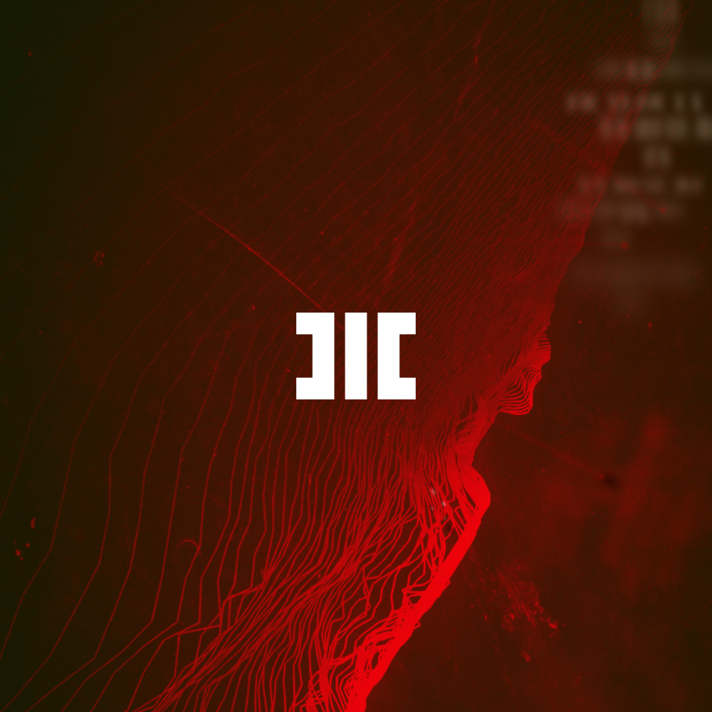

# HITECH CRIME | AUDIO FUTURA MICROLABEL UNIVERSE
```
MINIMAL FUTURA AGGRO TRAP / CHANTRAP / FUTURAP
```
**Hitech Crime** is a microlabel acting as a unified hub for creative and experimental audio projects. Its *creative aim* is to build a musical universe with unique lore and narratives.

Its *technical aim* is to research, develop and execute ideas in form of new wave interactive performances and create futuristic audio and related visual communication using creative technology.

As an expressive entity it explores and expresses topics ranging from *psychology*, *transhumanism*, *human edge*, *niche cyberpunk* to *predictive societal changes of the future in relation to the advancement of technology*. 

# /// STRAINS [CREATORS]


## /// INJECTIONS [ALBUMS] | Current count: 44 EPs

Motifs: dead of blight, oracle, triangles, moth's flight, the life's search, hacking reality, hacker persona, meditation, attunement with the environment, isolation, separation.

Content Font Regime is `_` as `:` or `-`. Use `///` to designate line in code/text/content/header. Use hard brackets `[]` for additional info `[Rough Prototype] / [Zodiacal Series]`. 

Brutalist architecture and movement, monumental futura, dirty cyberpunk, self-improvement themes, high technology, minimalism, squad with a goal (hack the world). 

Use `Hitech Crime presents`? That was one of the initial ideas - to make it feel like a narrative. Moodboard audio series style? Moodboard transitions between songs both in audio and visual. Sequential montages but could be played in a different order or random (hard cut). Web series vibe from the 2010s.

[cover] [type of album] [narrative? conceptual? abstract?]

### /// HC01_ MOTHNODE_ Brutalizm Elektroniczny EP / Elektrobrutalizm 

[POLISH SEASON EPISODES]

Cinematic, Blade Runner style. Masks, weapons, tech, net, dirt, lowlife. 
Mercenaries. Contains an arc narrative.
+ MOTHNODE_ PRZENIEŚMY SIĘ W CZASIE / SKIT Social media, phone sounds turn into drone bass as  we travel into the future.
+ MOTHNODE_ DIGITAL LIFE HEIST (prod. HRTLZxMonki)        // digital life bank heist - peak build up
+ MOTHNODE_ SEKTA SKRILLA                                 // hauling the loot - low
+ MOTHNODE_ NEONOWE PROXY (prod. X)                      // rival ambush - medium
+ MOTHNODE_ POWSTANIE (prod. Monki)                       // successful fight ??? - peak 
+ MOTHNODE_ LAS (prod. Monki)                             // reflection, existential scream  - last release  
+ MOTHNODE_ PARĘ REWOLUCJI PÓŹNIEJ / REDUX OUTRO

[cover] [type of album] [narrative? conceptual? abstract?]

### /// HC02_ MOTHNODE_ Ryzomat EP 

[POLISH SEASON EPISODES]

Nature, civilization, transhumanism, every day life.
+ MOTHNODE_ SIŁA KULTU
+ MOTHNODE_ (MOJA) SIATKA
+ MOTHNODE_ RYZOMAT
+ MOTHNODE_ TRWAŁOŚĆ UMYSŁU

[cover] [type of album] [narrative? conceptual? abstract?]

### /// HC03_ MOTHNODE_ Lekki Okultyzm EP 

[POLISH SEASON EPISODES]

+ MOTHNODE_ ZGLISZCZA NICI                                 // lonely hacker
+ MOTHNODE_ Versus                                         // relationship anger, unjust treatment
+ MOTHNODE_ FLOTA DRONÓW                                   // drone workes, family mode of operation
+ MOTHNODE_ KEFLAR                                         
+ MOTHNODE_ Dla Mnie I Wszystkich (nope)
+ MOTHNODE_ Król Maskarada

[cover] [type of album] [narrative? conceptual? abstract?]

### /// HC04_ MOTHNODE_ Lost Net 

[ENGLISH SEASON EPISODES]

Darker, micro darkness type.
+ HC_SG34_Upgraded (Lost Net)
+ HC_SG38_Odds_Stacker (Lost Net)
+ HC_SG31_No_Help (Lost Net)
+ HC_SG36_Wreech (Lost Net)
+ HC_SG39_Triple_X (Lost Net)
+ HC_SG28_Shutdown (Lost Net)
+ HC_SG35_Upclick
+ HC_SG33_Stalker
+ HC_SG67_Why
+ HC_SG06_World_Of_Blight
+ HC_SG19_Lord_Of_Flies
+ HC_SG53_The_Fourth_Industrial_Revolution

[cover] [type of album] [narrative? conceptual? abstract?]

### /// HC05_ MOTHNODE_ Conspiracy (English Collab Album) 

[ENGLISH SEASON EPISODES]

Collaboration album - each song is a split with someone. Conquer the world together theme.

[cover] [type of album] [narrative? conceptual? abstract?]

### /// HC06_ MOTHNODE_ Plains of Trisight EP 

[ENGLISH SEASON EPISODES]

Slow, deep, esoteric, productivity themes. 

[cover] [type of album] [narrative? conceptual? abstract?]

### /// HC07_ MOTHNODE_ Technomancer/Techsoteric EP 

[ENGLISH SEASON EPISODES]

Cyberpunk Swag album. (purple album/royal)
- MOTHNODE_ The Hibernation 

[cover] [type of album] [narrative? conceptual? abstract?]

### /// HC08_ MOTHNODE_ In It Together (Dual Album) 

[ENGLISH SEASON EPISODES]

Album made exclusively with one other person.

[cover] [type of album] [narrative? conceptual? abstract?] 

### /// HC09_ MOTHNODE_ breachInjectProgram EP 

[ENGLISH SEASON EPISODES]

- Dark Aggro Cyberpunk Trap Metal. Aggrotrap. Trapmetal. Trapcore. Wkurwcore.
Scream rap album.
+ MOTHNODE_ ELECTR1C VE1NS
+ MOTHNODE_ rvy
+ MOTHNODE_ 1gn0rvnt
+ MOTHNODE_ trust 1n vn1mv

[cover] [type of album] [narrative? conceptual? abstract?]

### /// HC10_ MOTHNODE_ Skuld EP 

[ENGLISH SEASON EPISODES]

https://en.wikipedia.org/wiki/Skuld
Futuristic viking vibe. Sample: https://www.youtube.com/watch?v=6FiMI502kPY
Tribal, drums, tantric bass, electronic elements, minimal tho.

- Ivald ›  The father of the dwarfs that made Sif's hair, the ship Skidbladner, and Odin's spear Gungner.
- Muspelheim ›  The world of blazing light before the creation.
- Nidhug ›  A serpent in the nether world.
- Niflheim ›  The world of mist before the creation.
- Skuld ›  The norn of the future.
- Ymer ›  The huge giant out of whose body the world was created.

[cover] [type of album] [narrative? conceptual? abstract?]

### /// HC11_ MOTHNODE_ Northern Invasion 

[ENGLISH SEASON EPISODES / ICELANDIC LANG]

More of a reality album. Event album. Lasy islandzkie i wodospady to te nasze marzenia
Polska to rzeczywistosc. Going to Sara Mora and making a whole album with her including visuals and concepts.

- MOTHNODE_ Keflar
- MOTHNODE_ Sherpa
- MOTHNODE_ Skadyssa

[cover] [type of album] [narrative? conceptual? abstract?]

### /// HC12_ MOTHNODE_ Mantra EP 

[ENGLISH SEASON EPISODES]

Album using bass as a meditative technique.
- MOTHNODE_ Cleanse
- MOTHNODE_ Dao
- MOTHNODE_ Eighth Chakra
- MOTHNODE_ Koan (Lesson of the Koans) https://www.youtube.com/watch?v=Pd-4dKaK_04
- MOTHNODE_ Samsara

[cover] [type of album] [narrative? conceptual? abstract?]

### /// HC13_ MOTHNODE_ Ksiega Szeptow 

[POLISH SEASON EPISODES]

Pagan futurism.

[cover] [type of album] [narrative? conceptual? abstract?]

### /// HC14_ MOTHNODE_ Tourist Through Life EP 

[ENGLISH SEASON EPISODES]

Fleeting observer from a distance. Unseen presence. Story of life.

[cover] [type of album] [narrative? conceptual? abstract?]

### /// HC15_ MOTHNODE_ Tactical EP 

[ENGLISH SEASON EPISODES]

Operative theme. Agents. Missions. Hitech but not cyberpunk, not so distant future. / Agent Album
- MOTHNODE_ Agent
- MOTHNODE_ Runners
- MOTHNODE_ cl0ser thvn d1stvnt t0 myself
- MOTHNODE_ Sparrows
- MOTHNODE_ The Little Grey Man
- MOTHNODE_ Exfiltration Container
- MOTHNODE_ Putpocket (person specializing in planting things in pockets)

[cover] [type of album] [narrative? conceptual? abstract?]

### /// HC16_ MOTHNODE_ Wakanda EP 

[ENGLISH SEASON EPISODES]

Tribal african rhytms and chants that transform into deep bass and trap.
- Children of Vibration / Vibra?

[cover] [type of album] [narrative? conceptual? abstract?]

### /// HC17_ MOTHNODE_ Hybrids On-going Album 

[ENGLISH SEASON EPISODES]

Album mixtape containing all of my collaborations with others.

[cover] [type of album] [narrative? conceptual? abstract?]

### /// HC18_ MOTHNODE_ Shadow Work EP 

[ENGLISH SEASON EPISODES]

- Dealing with your inner demons.
- https://scottjeffrey.com/shadow-work/

[cover] [type of album] [narrative? conceptual? abstract?]

### /// HC19_ MOTHODE_ Ritual of the Morning Sun EP

[ENGLISH SEASON EPISODES]

Based on my day schedule and productivity evangelism. Album starts with the actual morning ritual initiation by Helve OS.
+ HC_SG49_Slowclap
+ HC_SG26_Crave
+ HC_SG32_Going_Wrong
+ HC_SG51_Colorized_World

[cover] [type of album] [narrative? conceptual? abstract?]

### /// HC20_ MOTHNODE_ Wartrap EP 

[ENGLISH SEASON EPISODES]

Heavy, incoming forces type of vibe. Impending doom. Army march music feeling.

[cover] [type of album] [narrative? conceptual? abstract?]

### /// HC21_ MOTHNODE_ Twin Peaks / Wrapped In Plastic / Laura's Dream EP 

[ENGLISH SEASON EPISODES]

https://cinematicdetective.wordpress.com/2018/09/17/a-cry-for-compassion-twin-peaks-season-three/
“Through the darkness of future past, the magician longs to see, one chance out between two worlds, fire walk with me!”
- Twin Peaks vibe concept album. 60s music and vibe mixed with trap. Kind of like an audio narrative series.
Our dreams create our reality. Some are capable of creating powerful dreams that have great influence over all of us.
- MOTHNODE_ Into The Peaks ("Diane, it's 5:47pm and I'm about to enter the lovely town of...")
- MOTHNODE_ Wrapped in Plastic
- MOTHNODE_ Laura's Dream
- MOTHNODE_ The Black Lodge
- MOTHNODE_ Of Owls And Electricity
- MOTHNODE_ One-eyed Jack's
- MOTHNODE_ No Arm To Spare
- MOTHNODE_ Ocean of Memory
- MOTHNODE_ WWACD
- MOTHNODE_ The Giant Says
- MOTHNODE_ Bob in the Mirror

[cover] [type of album] [narrative? conceptual? abstract?]

### /// HC22_ MOTHNODE_ Rzad Mistykow EP 

[POLISH SEASON EPISODES]

Ayn Rand in Polish reality. "Ludzie którzy uważają, że należy im się twoja pomoc to kanibale."
- MOTHNODE_ Mistycy Ducha
- MOTHNODE_ Mistycy Mięśni
- MOTHNODE_ Emulgat Produkcyjny
- MOTHNODE_ Eksodus
- MOTHNODE_ John Galt

[cover] [type of album] [narrative? conceptual? abstract?]

### /// HC23_ MOTHNODE_ Urban Mythology EP 

[ENGLISH SEASON EPISODES]

MOTHNODE_ Tied Shoes Over A Powerline (drug dealer in the area sign?)

[cover] [type of album] [narrative? conceptual? abstract?]

### /// HC24_ MOTHNODE_ Triangle of Fire EP (Zodiacal Series) 

[ENGLISH SEASON EPISODES]

Fire within fire. Triangle within triangle. Flames, smoke and edges. Gold ornaments, ritual imagery. True self. Awakening.
- MOTHNODE_ Aries
- MOTHNODE_ "here i was born but watered down"

[cover] [type of album] [narrative? conceptual? abstract?]

### /// HC25_ MOTHNODE_ Huna EP 

[ENGLISH SEASON EPISODES]

"These people say our ancestors came here from the stars at tens of thousands of years ago. They brought with them a sacred wisdom called Ho'ala Huna (Hawai'ian words that mean: "that which causes an awakening to the secret or sacred awareness of Reality.") This knowledge was said to be the ultimate science of the world of spirit as well as the world of form
- MOTHNODE_ Ike
- MOTHNODE_ Kala
- MOTHNODE_ Makia
- MOTHNODE_ Manawa
- MOTHNODE_ Aloha
- MOTHNODE_ Mana
- MOTHNODE_ Pono

[cover] [type of album] [narrative? conceptual? abstract?]

### /// HC26_ MOTHNODE_ Dopamine Trails EP 

[ENGLISH SEASON EPISODES]

- MOTHNODE_ Animal and the Human
- MOTHNODE_ Ghost in the Machines
- MOTHNODE_ Qoooikfix [Quickfix] (HC_SG122)
(dopamine trails theme)

[cover] [type of album] [narrative? conceptual? abstract?]

### /// HC27_ MOTHNODE_ Edge Butterfly EP 

[ENGLISH SEASON EPISODES]

what Saramora said - i think edge butterfly is a moth
- MOTHNODE_ Flight's Edge
- MOTHNODE_ Night Butterfly / Edge Butterfly
- MOTHNODE_ Cocoon

[cover] [type of album] [narrative? conceptual? abstract?]

### /// HC28_ MOTHNODE_ HIQ / haiku EP 

[ENGLISH SEASON EPISODES]

High IQ-themed album. Visualization of how a world would seem when run by highly intelligent individuals. Assess, integrate, synthesize, postulate,  create coherent and useful mind pictures of the world.
- MOTHNODE_ Branching Trails of Thought

[cover] [type of album] [narrative? conceptual? abstract?]

### /// HC29_ MOTHNODE_ Heisenberg Effect EP 

[ENGLISH SEASON EPISODES]

- MOTHNODE_ Uncertain Principle
- MOTHNODE_ Play & Change
- MOTHNODE_ The Outcome Myriads

> Observation that the very act of becoming a player changes the game being played. It is reflected in interviewing process where the interviewees tend to give answers they think interviewer wants to hear. Named after German Noble-laureate physicist Werner Karl Heisenberg (1901-76) whose uncertainty principle states that (in particle physics experiments) the very act of observing alters the position of the particle being observed, and makes it impossible (even in theory) to accurately predict its behavior. See also observer inseparability.

> Read more: http://www.businessdictionary.com/definition/Heisenberg-effect.html

[cover]  [type of album] [narrative? conceptual? abstract?]

### /// HC30_ MOTHNODE_ Format Duszy EP 

[POLISH SEASON EPISODES]

- MOTHNODE_ Zmierzch (Prod. Clover)

[cover]  [type of album] [narrative? conceptual? abstract?]

### /// HC31_ MOTHNODE_ Rhizome EP / Ryzom (differentiate from Ryzomat, perhaps different naming) 

[ENGLISH SEASON EPISODES]

- originally Ryzom was supposed to be the name of the album containing Polish 'Ryzomat' song but I'd like to dive deeper into the topic
- album based on the abstract strata of the philosophy of rhizome. Soundscape almost. Natural soundscape + bass and delicate beat. Along with the album comes a designed visualization showcasing a visual and structural interpretation of the philosophy.

[cover]  [type of album] [narrative? conceptual? abstract?]

### /// HC32_ MOTHNODE_ DNA Prelude EP [Progression Series]  

[ENGLISH SEASON EPISODES]

(these could also be songs but I like the idea of overarching changing theme)

[cover]  [type of album] [narrative? conceptual? abstract?]

### /// HC33_ MOTHNODE_ Transhuman EP [Progression Series]  

[ENGLISH SEASON EPISODES]

[cover]  [type of album] [narrative? conceptual? abstract?]

### /// HC34_ MOTHNODE_ Posthuman EP [Progression Series]  

[ENGLISH SEASON EPISODES]

[cover]  [type of album] [narrative? conceptual? abstract?]

### /// HC35_ MOTHNODE_ Singularity EP [Progression Series]  

[ENGLISH SEASON EPISODES]

[cover]  [type of album] [narrative? conceptual? abstract?]

### /// HC36_ MOTHNODE_ Mothraiser EP [Hellraiser Vibe]  

[ENGLISH SEASON EPISODES]

- Gore vibe, hell, darkness, nature.

[cover]  [type of album] [narrative? conceptual? abstract?]

### /// HC37_ MOTHNODE_ Sacrificial EP  

[ENGLISH SEASON EPISODES]

Deep slow. "Sa-cri-fiiiice"

[cover] [type of album] [narrative? conceptual? abstract?]

### /// HC38_ MOTHNODE_ The Purge EP 

[ENGLISH SEASON EPISODES]

Purging bad progs with bass.

[cover] [type of album] [narrative? conceptual? abstract?]

### /// HC39_ MOTHNODE_ I0N0F0J 

[ENGLISH SEASON EPISODES]

INFJ album. "aye aye, go an extra mile with me and you reach the core"
- songs based on INFJ character - intuition, feeling, judgement

[cover] [type of album] [narrative? conceptual? abstract?]

### /// HC40_ ICE7 EP  

[ENGLISH SEASON EPISODES]

Hardcore futura album - distant future. Miners gathering rare types of ice from asteroids.
- Two shadows on a distant planet with 2 suns ("got more shadows in me than the rest, location-wise I'd say it's clear")
- For heavy futura album about void miners >  ICE7 - rare type of ice (Eve Online vibes)

Tracklisting:
- MOTHNODE_ Offworld (scifi futura album)
- MOTHNODE_ ICE7

[cover] [type of album] [narrative? conceptual? abstract?]

### /// HC41_ MOTHNODE_ Neuralink (Neural Ink) EP  

[ENGLISH SEASON EPISODES]

Dendritic arbour. /// cell body axon = soma
- MOTHNODE_ Dendryte
- MOTHNODE_ Body Cell
- MOTHNODE_ Soma
- MOTHNODE_ Ax(i)on

[cover] [type of album] [narrative? conceptual? abstract?]

### /// HC42_ MOTHNODE_ Error_default EP 

[ENGLISH SEASON EPISODES]

Social scripts focus album.
- MOTHNODE_ Are You (HC_SG136) - proto on dropbox/insta

### /// HC43_ Satsu x MOTHNODE_ X EP 

[ENGLISH/SPANISH/POLISH SEASON EPISODES]

Wait for Satsu's decision.

- **Satsu Song**
Miedo de mi 
Miedo de mi
Miedo de mi
Miedo de mi
Tengo el demonio hablándole a mi oreja
Ya tengo mil 
Tiros contados pa la balacera
El ídolo tuyo es una marioneta
Dale en la nuca 
Subelo a la guagua

Ya me tomé la tableta de xanax
Pintando con tu sangre el pentagrama
Se abre tu pecho y te salen garras
Y así me robó de tu alma
Miedo mi 
Tu cara de horror 
Cuando me vistes empacado en el congelador

(Demon voices)
No quedarán tus huesos después de la cena
Dale un latigazo pa que pague por sus penas
Ya tengo tu medula congelada en la nevera

- **Satsu Song**
- **Satsu x MOTHNODE Song** (Satsu lead) (HC_SG140)  autotune-like song somewhere!
- MOTH lead + satsu verses **MOTHNODE x Satsu Song** (Mothnode lead) (HC_SG141) https://www.youtube.com/watch?v=A-51LxYY2_k
- MOTH + Satsu adds **MOTHNODE_ Stay With The Flow** (HC_SG142) https://www.youtube.com/watch?v=8RUG3TIVMSk
- MOTH **MOTHNODE_ Get'em Snitch** (HC_SG143) https://www.youtube.com/watch?v=h-0CrfyHt4Q

```
Fear of me 
Fear of me 
Fear of me 
Fear of me 
I have the devil talking to my ear 
I already have a thousand 
Shots counted for the shooting 
The idol of yours is a puppet 
Hit the neck Upload it to the bus
I already took the xanax tablet 
Painting with your blood the pentagram 
Your chest opens and claws come out
And so it robbed me of your soul 
Fear me
Your horror face 
When you dress me packed in the freezer

(Demon voices) 
There will be no bones left after dinner 
Give him a whip to pay for his sorrows 
I already have your medulla frozen in the fridge
```

Structure:
1. Satsu
2. Satsu (MOTH just adds)
3. Satsu Lead x MOTH full verses
4. MOTH Lead x You full verses
5. MOTH (Satsu just adds)
6. MOTH

Alt structure:
1. You (Moth just adds)
2. You Lead x Me full verses
3. Me Lead x You full verses
4. Me (Satsu just adds)

### /// HC44_ MOTHNODE_ CBCBCBD EP 

[ENGLISH SEASON EPISODES]

- MOTHNODE_ CBD Regime (CBD EP)
- MOTHNODE_ Tactical Drop Squad (CBD EP)

# SONG & ALBUM IDEAS
- idea make a synthetic language to sing/rap in
- EP where each song is basically an episode of a web series (this could slowly turn into a trap musical narrative haha)
- MOTHNODE_ SLC6A3 (Gene codename - dopamine transporter deficiency syndrome - good for productivity esoterism albums)

https://ghr.nlm.nih.gov/gene/SLC6A3

> The SLC6A3 gene provides instructions for making a protein called the dopamine transporter or DAT. This protein is embedded in the membrane of certain nerve cells (neurons) in the brain, where it transports a molecule called dopamine into the cell. Dopamine is a chemical messenger (neurotransmitter) that relays signals from one neuron to another. Dopamine has many important functions, including playing complex roles in thought (cognition), motivation, behavior, and control of movement.

> To transmit signals, dopamine is released into the space between neurons (the synaptic cleft), where it attaches (binds) to receptors on the surface of neighboring neurons. The dopamine transporter brings dopamine from the synaptic cleft back into neurons for reuse. The activity of the transporter determines how much dopamine is present in the synaptic cleft and for how long. This activity makes the transporter a major controller of dopamine signaling in the brain.

- MOTHNODE_ Black Flood (wave of movement, production, industrial)
- MOTHNODE_ Oxytocin [Attachment Chemical]
- MOTHNODE_ Interna/ (not belonging to anything, being one with the internal will - world moves, you flow)
- MOTHNODE_ Circle Round (layers of external)
- MOTHNODE_ All-seeing Eye (.) -- Geometric All-seeing eye theme.
- MOTHNODE_ Task At Hand -- hypesong, "gunna get it done" "they drop their act again, (no) core down, we gon- fucking get it done"
- MOTHNODE_ Gibson In The Dark (related to Neuromancer, meta, song from a third perspective, observing the creator)
- MOTHNODE_ ? (Riddim Visu, riddim type songs, "riddim" in the universe of Hitech Crime is an audiovisual interactive script, the audience is going to be coded with riddims they can interact with during the experience).
- "Jail of your happiness so full of regrets, you think it protects xxx (deflect)"
- "All I've got is Hitech Crime" / "All I have left is Hitech Crime"
- MOTHNODE_ Attunement to Scripted Identities
- MOTHNODE_ Trappist-G (trappist planets - check out the term haha)
- wtf? "mio od na na/mid od ha na sztorc, mój squad, mój vibe, mój świat" ?
- Self-made trap beat made from own natural audio samples (sticks, stones, leaves, water, ooh the field recording session would be glorious)
- "wersy w bletkach na rewersie pełen rękaw"
- MOTHNODE_ I is Patient (self)
- MOTHNODE_ Follow the Trail
- MOTHNODE_ Mulder Mulder Moo (X-Files hahahahahaha)
- MOTHNODE_ Inspectah
- MOTHNODE_ Gapper (cyberpunk term, filler/fixer/climber) - scaling heights, gap between the bottom and the top of the city.
- MOTHNODE_ Incognitas (Anon)
- MOTHNODE_ Cogito Ergo Sum [Lies]
- MOTHNODE_ Brute Truth
- MOTHNODE_ It Follows
- MOTHNODE_ Black Cross
- MOTHNODE_ Cocoons (moth/Spawn)
- MOTHNODE_ Mortimer
- MOTHNODE_ Blood to the blood god
- MOTHNODE_ Praxis (cyberpunk futura)
- MOTHNODE_ Jake Hill & Hide
- MOTHNODE_ Mothra (nature, flora and fauna)
---

All songs: [NOT ALL SONGS - UPDATE THE LIST]

+ HC_SG01_Digital_Life_Heist (Digital Brutalism) [PL]  [DIGITAL BRUTALISM]
+ MOTHNODE_ Digital Life Heist (Prod. HRTLZ) Soundcloud
+ MOTHNODE_ Digital Life Heist (Prod. HRTLZ) Spotify
+ MOTHNODE_ Digital Life Heist (Prod. HRTLZ) Music Video - YouTube
+ MOTHNODE_ Digital Life Heist (Prod. HRTLZ) Instagram Video Highlight Multipost (Row)
+ MOTHNODE_ Digital Life Heist (Prod. HRTLZ) Instagram Music Video Link
+ MOTHNODE_ Digital Life Heist (Prod. HRTLZ) Instagram Music Video Highlight
+ MOTHNODE_ Digital Life Heist (Prod. HRTLZ) Facebook Post
+ MOTHNODE_ Digital Life Heist (Prod. HRTLZ) Facebook Music Highlight Video

---

+ HC_SG02_Neon_Proxy (Digital Brutalism) [PL] [DIGITAL BRUTALISM]
+ MOTHNODE_ Neon Proxy (Prod. X) Soundcloud
+ MOTHNODE_ Neon Proxy (Prod. X) Spotify
+ MOTHNODE_ Neon Proxy (Prod. X) Music Video - YouTube
+ MOTHNODE_ Neon Proxy (Prod. X) Instagram Video Highlight Multipost (Row)
+ MOTHNODE_ Neon Proxy (Prod. X) Instagram Music Video Link
+ MOTHNODE_ Neon Proxy (Prod. X) Instagram Music Video Highlight
+ MOTHNODE_ Neon Proxy (Prod. X) Facebook Post
+ MOTHNODE_ Neon Proxy (Prod. X) Facebook Music Highlight Video

---

+ HC_SG03_Sekta_Skrilla (Digital Brutalism) [PL] 

---

+ HC_SG04_Flota_Dronow (Digital Brutalism) [PL]
+ MOTHNODE_ Flota Dronów (Prod. X) Soundcloud
+ MOTHNODE_ Flota Dronów (Prod. X) Spotify
+ MOTHNODE_ Flota Dronów (Prod. X) Music Video - YouTube
+ MOTHNODE_ Flota Dronów (Prod. X) Instagram Video Highlight Multipost (Row)
+ MOTHNODE_ Flota Dronów (Prod. X) Instagram Music Video Link
+ MOTHNODE_ Flota Dronów (Prod. X) Instagram Music Video Highlight
+ MOTHNODE_ Flota Dronów (Prod. X) Facebook Post
+ MOTHNODE_ Flota Dronów (Prod. X) Facebook Music Highlight Video

---

+ HC_SG05_Las (Digital Brutalism) [PL]
+ HC_SG06_World_Of_Blight (Lost Net)
+ HC_SG07_Mindchip
+ HC_SG08_Uprising (change to Powstanie) (Digital Brutalism) [PL] [DIGITAL BRUTALISM]
+ HC_SG09_Ignorant (Lost Net)
+ HC_SG10_Glebia [PL] [DIGITAL BRUTALISM]
+ HC_SG11_Ja_Nie_Moge_Tak_Zyc [PL] [DIGITAL BRUTALISM]
+ HC_SG12_Jungsta [PL] [DIGITAL BRUTALISM]
+ HC_SG13_Profiles_Of_Negation
+ HC_SG14_Dla_Mnie_I_Dla_Wszystkich (Digital Brutalism) [PL]
+ HC_SG15_Zgliszcza_Nici (Digital Brutalism) [PL] [DIGITAL BRUTALISM]
+ HC_SG16_Rage
+ HC_SG17_Paradygmat [PL]
+ HC_SG18_Spojrzenie [PL]
+ HC_SG19_Lord_Of_Flies
+ HC_SG20_Autumn
+ HC_SG21_Klatka [PL]
+ HC_SG22_Wszystko_W_Pyl [PL]
+ HC_SG23_Prety [PL]
+ HC_SG24_Zerwikaptur [PL]
+ HC_SG25_Versus (Digital Brutalism) [PL]
+ HC_SG26_Crave (Lost Net)
+ HC_SG27_Ryzom [PL]
+ HC_SG28_Shutdown (Lost Net)
+ HC_SG29_mlodszy_joe_x_mothnode (?) [PL]
+ HC_SG30_Ray (rename) (Lost Net)
+ HC_SG31_No_Help (Lost Net)
+ HC_SG32_Going_Wrong (Lost Net)
+ HC_SG33_Stalker (Lost Net)
+ HC_SG34_Upgraded (Lost Net) / NORBI x MOTHNODE_ XXX
+ HC_SG35_Upclick (Lost Net)
+ HC_SG36_Wreech (Lost Net)
+ HC_SG37_Closer_Than_Distant_To_Myself (Lost Net)
+ HC_SG38_Odds_Stacker (Lost Net)
+ HC_SG39_Triple_X (Lost Net)
+ HC_SG40_Origin
+ HC_SG41_Cannibal
+ HC_SG42_Sublimation
+ HC_SG43_Fuckya
+ HC_SG44_Electric_Veins
+ HC_SG45_Falling_Time
+ HC_SG46_Ukrycie
+ HC_SG47_Danish
+ HC_SG48_Trust_In_Anima
+ HC_SG49_Slowclap
+ HC_SG50_Unnamed
+ HC_SG51_Colorized_World
+ HC_SG52_Zaczne_W_Cos
+ HC_SG53_The_Fourth_Industrial_Revolution
+ HC_SG54_Insidious
+ HC_SG55_No
+ HC_SG56_Pristine_Dirt
+ HC_SG57_Dream
+ HC_SG58_Unnamed
+ HC_SG59_Unnamed (prod. Monki) - Monki will make a beat. Chant, ritual.
+ HC_SG60_Keflar
+ HC_SG61_Icelandic_Beat (friend from Iceland will make a beat)
+ HC_SG62_BATTOU_MOTH_Rakanichu (FEATURE)(PUBLISHED)
+ HC_SG63_BATTOU_MOTH_Bombero_Gang (FEATURE)(PUBLISHED)
+ HC_SG64_BATTOU_MOTH_Maniacos_3_La_Sena (FEATURE)
+ HC_SG65_DOPEYO_MOTH_X (FEATURE)
+ HC_SG66_
+ HC_SG67_
+ HC_SG68_GANJU_MOTH_PKP (FEATURE)

# Audiovisual IRL Experiences (Musical Narrative Universe)
Ideas for the visuals and setups for concerts. Could also be applied to live online concerts.
- wall of death with a vertical "laser gate" pulsing and expanding to separate two groups of people. It lifts in the middle before the clash as the drop comes.
- aggro popup concert from a mobile backpack audio unit
- secret location concerts
- "now we will cleanse the perimeter with bass to get rid of the (audible) bad programs" / "audio weapon" - purging tool
- laser-gating
- laser ceiling scissors (lasers shifting horizontally above user's head)
- concerts are literally audiovisual sets - theatrical almost, with placing importance on pacing, pressurizing and depressurizing the audience, tension vs relax vs intrigue.
- Look at the BTSM experiences they create (they include narrative experiences, lasers, smoke and colorful glitchy. Church of BTSM). It is more rave like tho.
- Dropbox contains a lot of visal inspirations. Comb through it!

# BLACKLANE_ Electronic soundscapes.

# Lekki Okultyzm - more lyrical Polish rap.

**Releases:**

# **TAGS**
brutalist, digitalarcana, real vs surreal, trap music, cyberpunk, humanedge, techwear, glitch, red, technoir, cyber, trapcore, trap, deathcore, rap, aggro, real, unreal, reality, digital, brutalism, ominous, futuristic, glitchy, noisy, screamrap, digital vibe, 

https://www.youtube.com/watch?v=JRVkxtjKvCE
ＳＡＤＷＡＶＥ ~ [FREE] SAD XXXTENTACION TYPE BEAT (SLOW LOFI RAP BEAT 2019)
